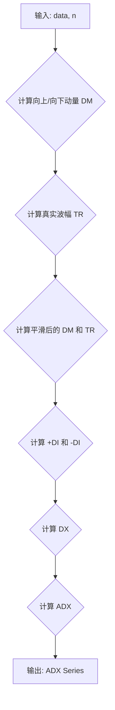

## 用途说明

计算金融市场数据的平均趋向指数（ADX）。ADX 指标用于衡量趋势的强度，不考虑趋势的方向。

## 参数

* data (pandas.DataFrame): 包含金融市场数据的 DataFrame，必须包含 'high'、'low' 和 'close' 列。
* n (int):  计算 ADX 的周期数，默认为 14。
## 用法

调用 ADX(data, n) 函数，传入金融市场数据和周期数，返回一个包含 ADX 值的 Series。

## 示例

```python
import pandas as pd
import yuhanbolh as lh

# 示例数据
data = pd.DataFrame({
    'high': [10, 11, 12, 11, 10, 11, 12],
    'low': [9, 10, 11, 10, 9, 10, 11],
    'close': [10.5, 11.2, 11.8, 10.9, 9.8, 10.7, 11.5]
})

# 计算 14 周期 ADX
adx = lh.ADX(data, 14)

# 打印结果
print(adx)
```

## 函数工作流程图



## 代码

```python
# 平均趋向指数ADX(14)，参数有2，一个是数据源，另一个是日期，一般为14，即ADX(data,14)
def ADX(data, n):
    up = data['high'] - data['high'].shift(1)
    down = data['low'].shift(1) - data['low']
    plusDM = pd.Series(np.where((up > down) & (up > 0), up, 0))
    minusDM = pd.Series(np.where((down > up) & (down > 0), down, 0))
    truerange = np.maximum(data['high'] - data['low'], np.maximum(np.abs(data['high'] - data['close'].shift()), np.abs(data['low'] - data['close'].shift())))
    plus = 100 * plusDM.ewm(alpha=1/n, min_periods=n).mean() / truerange.ewm(alpha=1/n, min_periods=n).mean()
    minus = 100 * minusDM.ewm(alpha=1/n, min_periods=n).mean() / truerange.ewm(alpha=1/n, min_periods=n).mean()
    sum = plus + minus
    adx = 100 * (np.abs(plus - minus) / np.where(sum == 0, 1, sum)).ewm(alpha=1/n, min_periods=n).mean()
    return pd.Series(adx, index=data.index, name='ADX').dropna()
```

