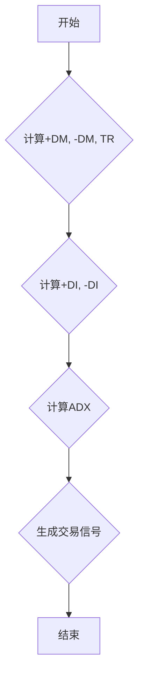

## 用途说明

计算平均趋向指数（ADX），并根据ADX、+DI和-DI的关系生成交易信号。

## 参数

* data (DataFrame): 包含股票或金融资产历史数据的DataFrame，必需包含'high'（最高价）、'low'（最低价）、'close'（收盘价）列。
* n (int): ADX计算的周期，通常设置为14。
## 返回值

DataFrame: 包含交易信号的DataFrame，其中：

* 1表示买入信号。
* -1表示卖出信号。
* 0表示中性信号。
## 使用方法

1. 准备包含'high'、'low'、'close'列的历史数据DataFrame。
1. 调用ADX_zb(data, n)函数，传入数据和周期参数。
1. 分析返回的DataFrame中的信号列，以制定交易策略。
## 示例

```python
import pandas as pd

# 示例数据
data = pd.DataFrame({
    'high': [10, 12, 15, 13, 16],
    'low': [8, 9, 11, 10, 12],
    'close': [9, 11, 14, 12, 15]
})

# 计算ADX并生成信号
adx_signals = ADX_zb(data, 14)
print(adx_signals)
```

## 函数工作流程图



## 函数代码

```python
def ADX_zb(data, n):
    # 计算当前最高价与前一天最高价的差值，以及前一天最低价与当前最低价的差值
    up = data['high'] - data['high'].shift(1)
    down = data['low'].shift(1) - data['low']

    # 判断哪些是上涨天，哪些是下跌天
    plusDM = np.where((up > down) & (up > 0), up, 0)
    minusDM = np.where((down > up) & (down > 0), down, 0)

    # 计算真实波幅
    truerange = np.maximum(data['high'] - data['low'], np.maximum(np.abs(data['high'] - data['close'].shift()), np.abs(data['low'] - data['close'].shift())))
    
    # 计算+DI和-DI
    plus = 100 * pd.Series(plusDM).ewm(alpha=1/n, min_periods=n).mean() / pd.Series(truerange).ewm(alpha=1/n, min_periods=n).mean()
    minus = 100 * pd.Series(minusDM).ewm(alpha=1/n, min_periods=n).mean() / pd.Series(truerange).ewm(alpha=1/n, min_periods=n).mean()

    # 计算ADX
    adx = 100 * (np.abs(plus - minus) / (plus + minus)).ewm(alpha=1/n, min_periods=n).mean()

    # 根据您给出的条件定义买入和卖出信号
    adx_plusDI = (adx > 20) & (plus > minus) & (plus.shift(1) < minus.shift(1))
    adx_minusDI = (adx > 20) & (plus < minus) & (plus.shift(1) > minus.shift(1))

    # 计算信号值：买入为1，卖出为-1，中立为0
    signal = np.where(adx_plusDI, 1, np.where(adx_minusDI, -1, 0))

    # 返回包含所有历史数据的DataFrame
    return pd.DataFrame({'ADX_' + str(n): signal})
```

