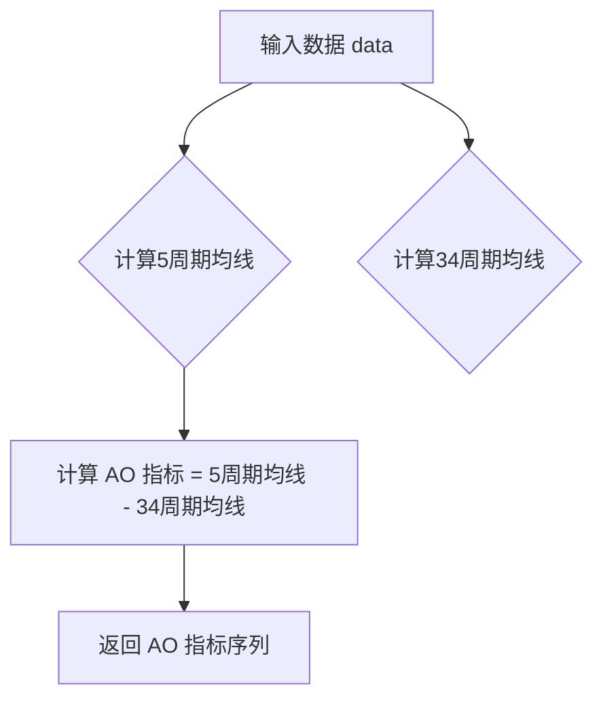

## 用途说明

该函数用于计算金融时间序列数据的动量震荡指标 (AO)。AO 指标是通过比较近期价格区间的中点和过去一段时间价格区间的中点来衡量市场动量的指标。

## 参数

* data (pandas.DataFrame): 包含金融时间序列数据的 DataFrame，必须包含 'high' 和 'low' 列，分别代表每个时间段的最高价和最低价。
## 返回值

* pandas.Series: 包含计算得到的 AO 指标值的 Series，索引与输入数据一致，名称为 'AO'。
## 用法

通过将包含 'high' 和 'low' 列的 DataFrame 传递给 AO 函数来计算 AO 指标。

## 示例

```python
import pandas as pd
import yuhanbolh as lh

# 示例数据
data = pd.DataFrame({
    'high': [10, 11, 12, 11, 10, 12, 13, 14, 15, 14],
    'low': [9, 10, 11, 10, 9, 11, 12, 13, 14, 13]
})

# 计算 AO 指标
ao_indicator = lh.AO(data)

# 打印结果
print(ao_indicator)
```

## 函数工作流程图



## 代码

```python
# 计算动量震荡指标(AO)，参数只有一个，即数据源
def AO(data):
    AO = (data['high'].rolling(5).mean() + data['low'].rolling(5).mean()) / 2 - (data['high'].rolling(34).mean() + data['low'].rolling(34).mean()) / 2
    # 指定返回的Series对象的索引为原始data的索引，并命名为'AO'
    return pd.Series(AO, index=data.index, name='AO').dropna()
```

