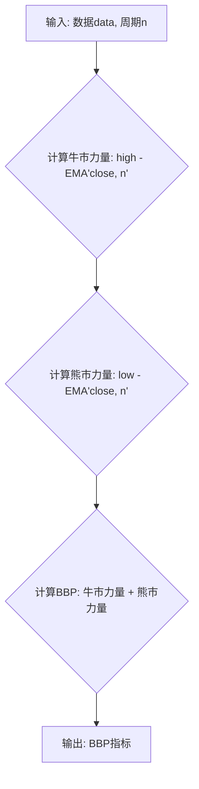

### 用途说明

计算金融市场中股票或其他资产的牛熊力量指标 (Bull Bear Power, BBP)。该指标用于衡量市场多头和空头的相对力量。

### 参数

* data (pandas.DataFrame): 包含金融市场数据的 DataFrame，必须包含 'high'、'low' 和 'close' 列，分别代表最高价、最低价和收盘价。
* n (int): 计算指数移动平均线的周期，默认为 13。
### 返回值

* pandas.Series: 包含 BBP 指标值的 Series，索引与输入数据 data 相同。
### 用法

通过调用 BBP(data, n) 函数计算 BBP 指标，其中 data 是包含市场数据的 DataFrame，n 是计算指数移动平均线的周期。

### 示例

```python
import pandas as pd
import yuhanbolh as lh

# 创建示例数据
data = pd.DataFrame({
    'high': [10, 12, 13, 11, 12],
    'low': [9, 10, 11, 10, 11],
    'close': [11, 11.5, 12, 10.5, 11]
})

# 计算 BBP 指标
bbp = lh.BBP(data, n=13)

# 打印结果
print(bbp)
```

### 流程图



## 代码

```python
# 计算Bull Bear Power牛熊力量(BBP)，参数有2，一个是数据源，另一个是日期，一般为20，但在tradingview取13，即BBP(data, 13)
def BBP(data, n):
    bullPower = data['high'] - data['close'].ewm(span=n).mean()
    bearPower = data['low'] - data['close'].ewm(span=n).mean()
    BBP = bullPower + bearPower
    return pd.Series(BBP, index=data.index, name='BBP').dropna()
```

