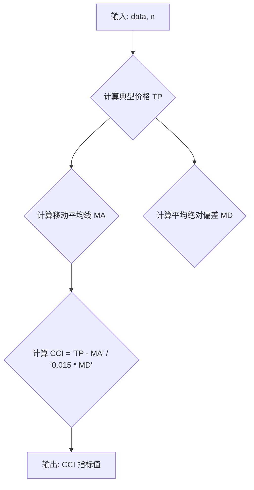

## 用途说明

该函数用于计算指定日期范围内的商品通道指数 (CCI)。CCI 是一种动量指标，用于评估资产价格与其平均价格的偏差程度，帮助判断超买或超卖情况。

## 参数

* data (pandas.DataFrame): 包含金融时间序列数据的 DataFrame，需包含 'high'、'low' 和 'close' 列，分别代表最高价、最低价和收盘价。
* n (int): 计算 CCI 的周期数，默认为 20。
## 返回值

* pandas.Series: 包含 CCI 指标值的 Series，索引与输入数据的索引相同。
## 用法

调用 CCI(data, n) 函数，传入包含金融数据的 DataFrame 和计算周期数，即可获取 CCI 指标值。

## 示例

```python
import pandas as pd
import yuhanbolh as lh

# 示例数据
data = pd.DataFrame({
    'high': [10, 11, 12, 13, 12],
    'low': [9, 10, 11, 12, 11],
    'close': [10.5, 11.2, 11.8, 12.5, 11.9]
})

# 计算 20 周期的 CCI
cci_values = lh.CCI(data, 20)

# 打印结果
print(cci_values)
```

## 函数工作流程图



## 代码

```python
# 计算CCI指标，参数有2，一个是数据源，另一个是日期，一般为20，即CCI(data, 20)
def CCI(data, n):
    TP = (data['high'] + data['low'] + data['close']) / 3
    MA = TP.rolling(n).mean()
    MD = TP.rolling(n).apply(lambda x: np.abs(x - x.mean()).mean())
    CCI = (TP - MA) / (0.015 * MD)
    return pd.Series(CCI, index=data.index, name='CCI_' + str(n)).dropna()
```

