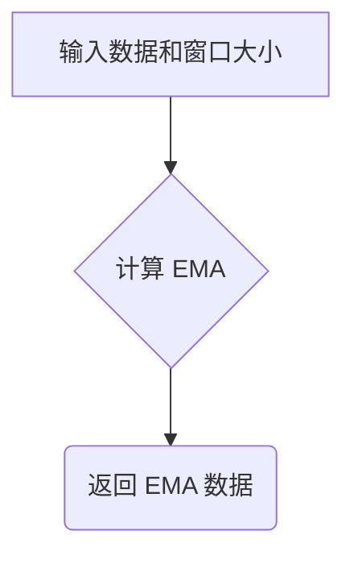

## 用途说明

该函数用于计算给定数据序列的指数移动平均线 (EMA)。

## 参数

* data (pd.DataFrame): 包含 'close' 列的 Pandas DataFrame，表示待计算 EMA 的数据序列。
* n (int): EMA 的窗口大小，即计算平均值时考虑的先前数据点的数量。
## 返回值

* EMA (pd.Series): 计算得到的 EMA 数据序列，以 Pandas Series 类型返回。
## 用法

函数调用示例及返回值说明：

```python
import yuhanbolh as lh

ema_data = EMA(data, n=12) 
```

其中：

* data 是包含待计算数据的 Pandas DataFrame。
* n 是 EMA 窗口大小，这里设置为 12。
* ema_data 是包含计算得到的 EMA 数据的 Pandas Series。
## 示例

```python
import pandas as pd

# 示例数据
data = pd.DataFrame({'close': [10, 12, 13, 11, 14, 15, 16, 17, 18, 19, 20]})

# 计算 5 日 EMA
ema_5 = EMA(data, n=5)

# 打印结果
print(ema_5)
```

## 函数工作流程图



## 代码

```python
def EMA(data, n):
    EMA = pd.Series(data['close'].ewm(span=n, min_periods=n).mean(), name='EMA_' + str(n))
    return EMA.dropna()
```

