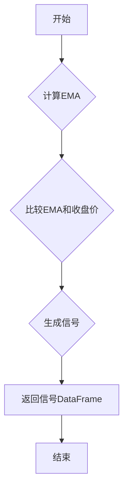

## 用途说明

根据指数移动平均线（EMA）与收盘价的比较，生成交易信号。

## 参数

* data (DataFrame): 包含股票或金融资产数据的DataFrame，必须包含'close'列。
* n (int): EMA的周期长度。
## 返回值

* DataFrame: 包含交易信号的DataFrame，'EMA_n'列表示信号，1代表买入，-1代表卖出，0代表中性。
## 使用方法

1. 准备包含'close'列的DataFrame数据。
1. 调用EMA_zb函数，传入数据和EMA周期。
1. 分析返回的DataFrame中的信号列，进行交易决策。
## 示例

```python
import pandas as pd

# 示例数据
data = pd.DataFrame({
    'close': [10, 11, 12, 13, 12, 14, 15, 14, 13, 15]
})

# 调用EMA_zb函数，计算10日EMA信号
ema_signal = EMA_zb(data, 10)

# 打印信号
print(ema_signal)
```

## 流程图



## 函数代码

```python
import pandas as pd
import numpy as np

# 获取指数移动平均线，参数有2个，一个是数据源，一个是日期。例如EMA_zb(data, 20)
def EMA_zb(data, n):
    # 计算n日EMA
    EMA = pd.Series(data['close'].ewm(span=n, min_periods=n).mean(), name='EMA_' + str(n))
    close = data['close']
    # 根据EMA和收盘价生成信号
    # 当收盘价大于EMA时，生成买入信号1
    # 当收盘价小于EMA时，生成卖出信号-1
    # 其他情况，生成中性信号0
    signal = np.where(EMA < close, 1, np.where(EMA > close, -1, 0))
    return pd.DataFrame(signal, columns=['EMA_' + str(n)])
```

