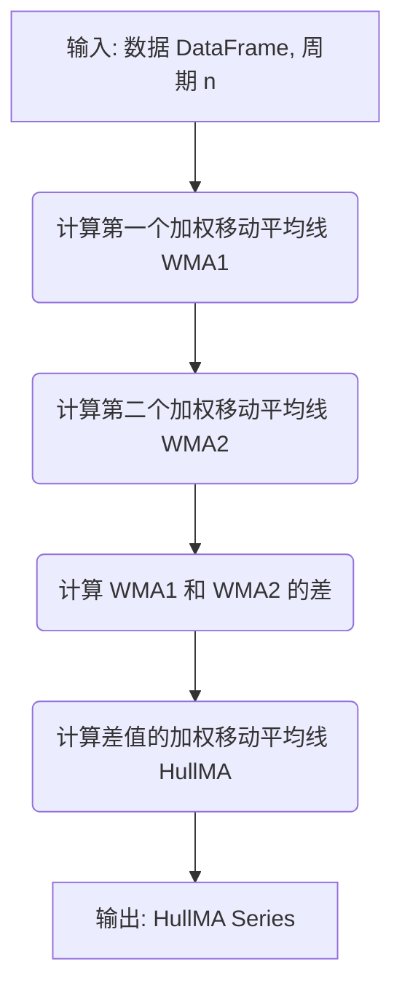

## 用途说明

HullMA 函数用于计算金融时间序列数据的 Hull 船体移动平均线。Hull 移动平均线是一种快速且平滑的移动平均线，可以减少滞后性并提高趋势变化的识别速度。

## 参数

* data (pandas.DataFrame): 包含金融数据的 Pandas DataFrame，必须包含 'close' 列，表示收盘价。
* n (int, optional):  移动平均线的周期长度，默认为 9。
## 返回值

* pandas.Series:  包含 Hull 船体移动平均线的 Pandas Series，命名为 'HullMA_' + str(n)。
## 用法

```python
import yuhanbolh as lh
hull_ma = HullMA(data, n=9)
```

其中：

* data 是包含 'close' 列的 Pandas DataFrame。
* n 是 Hull 移动平均线的周期长度，默认为 9。
## 示例

```python
import pandas as pd

# 创建示例数据
data = pd.DataFrame({'close': [10, 12, 15, 14, 16, 18, 20, 22, 24, 25]})

# 计算 9 周期 Hull 移动平均线
hull_ma = HullMA(data, n=9)

# 打印结果
print(hull_ma)
```

## 函数工作流程图 (Mermaid 格式)



## 代码

```python
# 计算Hull MA船体移动平均线 Hull MA (data,9)，参数有2，一个是数据源，另一个是日期，一般为9
def HullMA(data, n=9):
    def wma(series, period):
        weights = np.arange(1, period + 1)
        return series.rolling(period).apply(lambda x: np.dot(x, weights) / weights.sum(), raw=True)
    
    source = data['close']
    wma1 = wma(source, n // 2) * 2
    wma2 = wma(source, n)
    hullma = wma(wma1 - wma2, int(math.floor(math.sqrt(n))))
    # 指定返回的Series对象的名称
    hullma.name = 'HullMA_' + str(n)
    return hullma.dropna()
```

