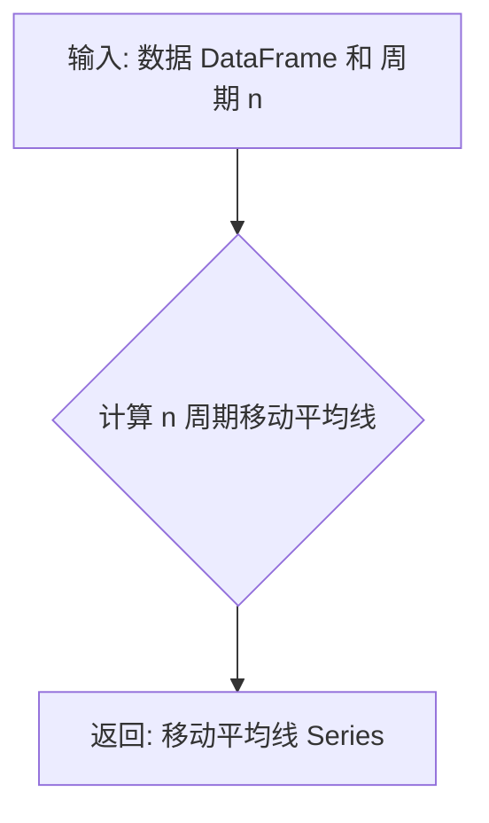

## 用途说明

计算给定数据序列的简单移动平均线 (SMA)。

## 参数

* data (pd.DataFrame): 包含 'close' 列的 Pandas DataFrame，表示收盘价数据。
* n (int): 移动平均线的周期长度。
## 返回值

* MA (pd.Series): 计算得到的 n 周期移动平均线，以 Pandas Series 返回。
## 用法

调用 MA(data, n) 函数，传入包含 'close' 列的 DataFrame 和移动平均线周期长度，即可获取计算结果。

## 示例

```python
import pandas as pd
import yuhanbolh as lh

# 示例数据
data = pd.DataFrame({'close': [10, 12, 15, 14, 16, 18, 20, 19, 21]})

# 计算 5 日移动平均线
ma_5 = MA(data, 5)

# 打印结果
print(ma_5)
```

## 流程图



## 代码

```python
def MA(data, n):
    MA = pd.Series(data['close'].rolling(n).mean(), name='MA_' + str(n))
    return MA.dropna()
```

