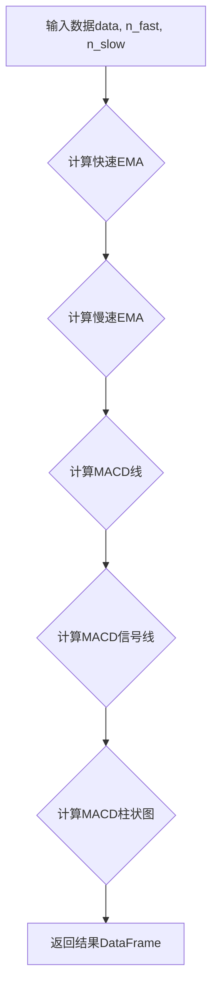

## 用途说明

该函数用于计算金融时间序列数据的MACD（Moving Average Convergence Divergence，指数平滑移动平均线）指标，包括MACD线、信号线和MACD柱状图。

## 参数

* data (pandas.DataFrame): 存放金融时间序列数据的DataFrame，必须包含'close'列，表示收盘价。
* n_fast (int): 计算快速移动平均线的周期，通常为12。
* n_slow (int): 计算慢速移动平均线的周期，通常为26。
## 返回值

* pandas.DataFrame: 包含以下列的DataFrame，使用与输入数据相同的索引：
## 用法

通过将包含收盘价和其他必要数据的DataFrame，以及快速和慢速移动平均线的周期传递给函数，可以轻松计算MACD指标。

## 示例

```python
import pandas as pd
import yuhanbolh as lh

# 示例数据
data = pd.DataFrame({
    'close': [10, 12, 15, 14, 16, 18, 20, 19, 17, 15]
})

# 计算MACD指标
macd_result = MACD_Level(data, 12, 26)

# 打印结果
print(macd_result)
```

## 流程图



## 代码

```python
# 计算MACD Lvel指标，参数有3个，第一个是数据源，其余两个为日期，一般取12和26，即MACD_Level(data, 12,26)
def MACD_Level(data, n_fast, n_slow):
    EMAfast = data['close'].ewm(span=n_fast, min_periods=n_slow).mean()
    EMAslow = data['close'].ewm(span=n_slow, min_periods=n_slow).mean()
    MACD = EMAfast - EMAslow
    MACDsignal = MACD.ewm(span=9, min_periods=9).mean()
    MACDhist = MACD - MACDsignal
    
    # 创建一个新的DataFrame来存储结果
    result = pd.DataFrame({
        'MACD': MACD,
        'MACDsignal': MACDsignal,
        'MACDhist': MACDhist
    }, index=data.index)  # 使用原始数据的索引
    
    return result.dropna()
```

