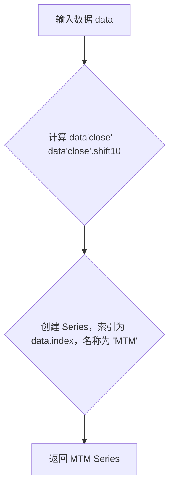

## 用途说明

该函数用于计算金融时间序列数据的动量指标 (Momentum Indicator)。动量指标是技术分析中常用的指标之一，用于衡量价格在一段时间内的变化速度。

## 参数

* data (pandas.DataFrame): 包含金融时间序列数据的 DataFrame，必须包含 'close' 列，表示收盘价。
## 返回值

* pandas.Series:  包含计算得到的动量指标值的 Series，索引与输入数据的索引相同，名称为 'MTM'。
## 用法

函数调用示例及返回值说明：

```python
import yuhanbolh as lh
lh.mtm_values = MTM(data)
```

其中：

* mtm_values: 包含计算得到的动量指标值的 Series。
## 示例

```python
import pandas as pd

# 示例数据
data = pd.DataFrame({'close': [10, 12, 15, 13, 16, 18, 20, 19, 22, 25]}, 
                    index=pd.date_range('2023-01-01', periods=10))

# 计算动量指标 (10)
mtm_values = MTM(data)

# 打印结果
print(mtm_values)
```

## 函数工作流程图



## 代码

```python
import pandas as pd

def MTM(data):
    """
    计算动量指标(10)，参数只有一个，即数据源
    """
    MTM = data['close'] - data['close'].shift(10)
    # 指定返回的Series对象的索引为原始data的索引
    return pd.Series(MTM, index=data.index, name='MTM').dropna()
```

