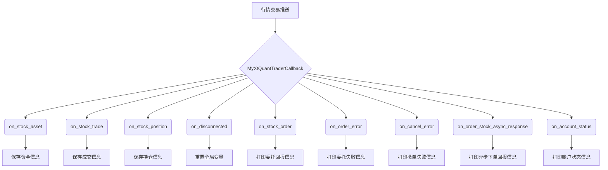

## 用途说明

该类继承自 XtQuantTraderCallback，用于接收并处理来自交易接口的行情和交易推送信息，包括资金变动、成交记录、持仓变动、委托回报、委托失败、撤单失败、异步下单回报和账户状态等。

## 参数

该类无需实例化时传递参数。

## 属性

* gj_db_path (str): 国金账户数据库文件路径，默认为 r'D:\wenjian\python\smart\data\guojin_account.db'。
## 方法

* on_stock_asset(self, asset)
* on_stock_trade(self, trade)
* on_stock_position(self, positions)
* on_disconnected(self)
* on_stock_order(self, order)
* on_order_error(self, order_error)
* on_cancel_error(self, cancel_error)
* on_order_stock_async_response(self, response)
* on_account_status(self, status)
## 示例

```python
class MyXtQuantTraderCallback(XtQuantTraderCallback):
    # ... (其他方法定义)

    def on_stock_trade(self, trade):
        # ... (处理成交信息)

    def on_order_error(self, order_error):
        # ... (处理委托失败信息)
```

## 流程图



## 完整代码

```python
# 定义qmt推送的类
class MyXtQuantTraderCallback(XtQuantTraderCallback):
    gj_db_path = r'D:\wenjian\python\smart\data\guojin_account.db'
    
    # 资金变动推送  注意，该回调函数目前不生效
    def on_stock_asset(self, asset):
        try:
            # 使用上下文管理器连接到SQLite数据库
            with sqlite3.connect(self.gj_db_path) as conn:

                # 创建DataFrame
                data = {
                    '账户类型': [asset.account_type],
                    '资金账号': [asset.account_id],
                    '现金': [asset.cash],
                    '冻结现金': [asset.frozen_cash],
                    '市值': [asset.market_value],
                    '总资产': [asset.total_asset]
                }
                df = pd.DataFrame(data)

                # 将DataFrame写入数据库，替换现有数据
                df.to_sql('manage_assets', conn, if_exists='replace', index=False)

            # 打印资金变动推送
            print("资金变动推送")
            print(asset.account_type, asset.account_id, asset.cash, asset.frozen_cash, asset.market_value, asset.total_asset)
        except Exception as e:
            print("出现错误:", e)

    # 成交变动推送，每增加一个策略都要往里增加保存数据表的名称
    def on_stock_trade(self, trade):
        try:
            # 使用上下文管理器连接到SQLite数据库
            with sqlite3.connect(self.gj_db_path) as conn:
            
                # 成交变动推送
                buy_sell = 1 if trade.order_type == 23 else -1 if trade.order_type == 24 else 0
                values = (
                    trade.account_id,        # 资金账号
                    trade.order_id,          # 订单编号
                    trade.strategy_name,     # 策略名称
                    trade.order_remark,      # 委托备注
                    convert_time(trade.traded_time),       # 成交时间
                    trade.order_type,        # 委托类型
                    trade.stock_code,        # 证券代码
                    trade.traded_price,      # 成交均价
                    trade.traded_volume,     # 成交数量
                    trade.traded_amount,     # 成交金额
                    buy_sell                # 买卖
                )
    
                # 使用策略名称与表名的映射字典简化选择插入的表的代码
                strategy_to_table = {
                    "基金网格": "execute_fund_grid_trade",
                    "基金基本技术": "execute_fund_basics_technical_trade",
                    "索提诺比率策略": "execute_sortino_ratio_trade",
                    "卡玛比率策略": "execute_calmar_ratio_trade"
                }
    
                table_name = strategy_to_table.get(trade.strategy_name, "unallocated_transaction")
                if table_name == "unallocated_transaction":
                    return
    
                insert_query = f"""
                INSERT INTO {table_name} (资金账号, 订单编号, 策略名称, 委托备注, 成交时间, 委托类型, 证券代码, 成交均价, 成交数量, 成交金额, 买卖)
                VALUES (?, ?, ?, ?, ?, ?, ?, ?, ?, ?, ?)
                """
                conn.execute(insert_query, values)
                conn.commit()
    
        except Exception as e:
            print("出现错误:", e)

    # 持仓变动推送  注意，该回调函数目前不生效
    def on_stock_position(self, positions):
        try:
            # 使用上下文管理器连接到SQLite数据库
            with sqlite3.connect(self.gj_db_path) as conn:

                # 准备插入的数据
                values = [(position.account_type,         # 账户类型
                           position.account_id,           # 资金账号
                           position.stock_code,           # 证券代码
                           position.volume,               # 持仓数量
                           position.can_use_volume,       # 可用数量
                           position.open_price,           # 平均建仓成本
                           position.market_value          # 市值
                          ) for position in positions]

                # 插入到account_holdings表
                insert_query = """
                INSERT INTO account_holdings (账户类型, 资金账号, 证券代码, 持仓数量, 可用数量, 平均建仓成本, 市值)
                VALUES (?, ?, ?, ?, ?, ?, ?)
                """
                conn.executemany(insert_query, values)
                conn.commit()

        except Exception as e:
            print("出现错误:", e)


    def on_disconnected(self):
        """
        连接断开
        :return:
        """
        print("connection lost, 交易接口断开，即将重连")

        global schedule_thread
        schedule_thread = None

    def on_stock_order(self, order):
        """
        委托回报推送
        :param order: XtOrder对象
        :return:
        """
        print("委托回报推送")
        print(order.stock_code, order.order_status, order.order_sysid)

    def on_order_error(self, order_error):
        """
        委托失败推送
        :param order_error:XtOrderError 对象
        :return:
        """
        print("委托失败推送")
        print(order_error.order_id, order_error.error_id, order_error.error_msg)

    def on_cancel_error(self, cancel_error):
        """
        撤单失败推送
        :param cancel_error: XtCancelError 对象
        :return:
        """
        print("撤单失败推送")
        print(cancel_error.order_id, cancel_error.error_id, cancel_error.error_msg)

    def on_order_stock_async_response(self, response):
        """
        异步下单回报推送
        :param response: XtOrderResponse 对象
        :return:
        """
        print("异步下单回报推送")
        print(response.account_id, response.order_id, response.seq)

    # 账户状态
    def on_account_status(self, status):
        """
        :param response: XtAccountStatus 对象
        :return:
        """
        print("账户状态，类型2为“证券账户”，状态：-1-无效；0-正常；4-初始化")   # http://docs.thinktrader.net/vip/pages/198696/#%E8%B4%A6%E5%8F%B7%E7%8A%B6%E6%80%81-account-status
        print(status.account_id, status.account_type, status.status)

```

