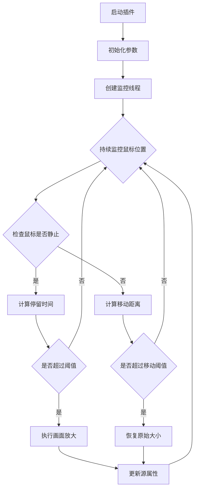

[OBS录播直播画面智能缩放大师脚本 | 三人聚智-余汉波程序小店](https://jy.sanrenjz.com/buy/6)

视频：[OBS口播录播直播利器：智能画面缩放插件_哔哩哔哩_bilibili](https://www.bilibili.com/video/BV18yXXYMEFm/?vd_source=247ac77d4ae7339ea06d0fec09aa8f70)

本文将深入解析一个为OBS Studio开发的智能画面缩放插件。这个插件通过Python语言实现，能够根据鼠标位置自动调整画面缩放效果，为直播观众带来更好的观看体验。

### 使用的技术栈

1. 核心技术：
1. 主要依赖：


## 代码结构与实现原理

### 核心参数设计

```python
scene_name = "场景"        # OBS场景名称
source_name = "显示器采集"  # 源名称
max_zoom = 2.0            # 最大缩放比例
min_zoom = 1.0           # 最小缩放比例
zoom_speed = 0.1         # 缩放变化速度
hold_time = 1.0          # 鼠标停留触发时间
move_threshold = 100.0   # 快速移动距离阈值
move_range = 50.0        # 放大区域移动范围
```

这些参数构成了插件的核心配置，可通过OBS界面动态调整，实现灵活的自定义配置。

### 工作流程图



### 核心功能实现

### 1. 初始化与配置管理

插件通过script_description()和script_properties()函数实现配置界面的创建：

```python
def script_properties():
    props = obs.obs_properties_create()
    # 添加各种配置项
    obs.obs_properties_add_text(props, "scene_name", "场景名称", obs.OBS_TEXT_DEFAULT)
    obs.obs_properties_add_text(props, "source_name", "源名称", obs.OBS_TEXT_DEFAULT)
    # ... 其他配置项
    return props
```

### 2. 鼠标位置监控系统

插件使用独立线程持续监控鼠标位置，避免影响OBS主程序性能：

```python
def update_properties():
    while running:
        mouse_x, mouse_y = get_mouse_position()
        current_time = time.time()
        # 处理鼠标位置变化
        # ...
```

### 3. 智能缩放算法

缩放算法包含以下关键要素：

* 鼠标停留检测
* 平滑过渡处理
* 边界检查
* 防抖动处理
```python
def calculate_distance(pos1, pos2):
    """计算两点之间的距离"""
    dx = pos2[0] - pos1[0]
    dy = pos2[1] - pos1[1]
    return (dx**2 + dy**2)**0.5
```

### 4. 画面更新机制

通过OBS API实现画面的动态更新：

```python
# 设置缩放
scale_vec = obs.vec2()
scale_vec.x = current_zoom
scale_vec.y = current_zoom
obs.obs_sceneitem_set_scale(scene_item, scale_vec)

# 设置位置
pos_vec = obs.vec2()
pos_vec.x = -offset_x * current_zoom
pos_vec.y = -offset_y * current_zoom
obs.obs_sceneitem_set_pos(scene_item, pos_vec)
```

## 性能优化与注意事项

### 1. 性能优化措施

1. 使用线程池管理监控线程
1. 实现缓存机制减少API调用
1. 优化计算逻辑，减少不必要的运算
### 2. 潜在问题与解决方案

1. 资源占用问题
1. 画面抖动问题
1. 边界处理问题
## 改进建议

### 1. 功能扩展

1. 添加自定义热键支持
1. 实现多显示器支持
1. 添加预设配置管理
### 2. 性能优化

1. 使用C++重写核心算法
1. 实现GPU加速支持
1. 优化内存使用
### 3. 用户体验

1. 添加可视化配置界面
1. 实现配置文件导入/导出
1. 添加实时预览功能
## 总结

本插件通过巧妙的算法设计和多线程处理，实现了流畅的智能画面缩放效果。虽然还有一些优化空间，但已经能够很好地满足大多数直播场景的需求。通过合理的参数配置和优化措施，可以在提供良好用户体验的同时，保持较低的系统资源占用。

## 参考资料

1. OBS Studio Python API文档
1. PyAutoGUI官方文档
1. Python多线程编程指南
1. 计算机图形学基础 - 图像缩放算法
