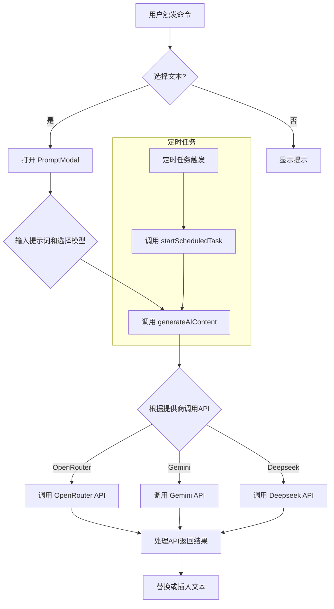

Obsidian AI Auto插件旨在利用AI模型自动生成内容并集成到Obsidian笔记软件中。它支持多种AI模型，包括OpenRouter、Gemini和Deepseek，并提供自定义模型选项。插件的核心功能在于根据用户提供的提示词和上下文，调用选择的AI模型生成文本，并将结果插入或替换笔记中的选定内容。此外，插件还支持创建定时任务，实现自动化内容生成和保存。

### 代码结构与功能

插件代码主要由以下几个部分组成：

1. OpenRouterPlugin类: 这是插件的核心类，负责插件的加载、卸载、设置管理、命令注册、定时任务管理以及与AI模型的交互。
1. PromptModal类:  该类定义了一个模态框，用于用户输入提示词、选择AI模型和模板，并触发AI内容生成。
1. OpenRouterSettingTab类: 定义了插件的设置页面，允许用户配置API Key、默认模型、自定义模型以及定时任务。
1. CustomModelModal类:  用于添加自定义AI模型的模态框。
1. ScheduledTaskModal类: 用于创建和编辑定时任务的模态框。
1. 内置模型BUILT_IN_MODELS:  预定义了一组常用的AI模型，包含模型标识、显示名称和提供商信息。
1. 默认设置DEFAULT_SETTINGS: 定义了插件的默认设置，包括API Key、默认模型和模板路径等。
核心功能详解:

* AI内容生成:  generateAIContent方法是AI内容生成的核心逻辑。它根据选择的模型和提供商，调用相应的API，并将用户提示词和上下文发送给AI模型。该方法支持OpenRouter、Gemini和Deepseek三种API。
* 上下文处理: 在调用AI API之前，插件会对用户选择的文本进行预处理，包括解析Dataview查询、展开Obsidian内链，并将处理后的内容作为上下文添加到提示词中。这使得AI模型能够理解笔记中的相关信息，生成更准确的内容。
* 定时任务: 插件支持创建定时任务，自动生成内容并保存到指定路径。startScheduledTask方法负责启动单个定时任务，startAllScheduledTasks和stopAllScheduledTasks方法分别用于启动和停止所有定时任务。定时任务支持每日执行和单次执行两种类型。
* 模板管理: 插件允许用户指定模板文件夹路径，并加载其中的Markdown文件作为提示词模板。用户可以在PromptModal中搜索和选择模板，快速填充提示词。
* 自定义模型: 用户可以通过CustomModelModal添加自定义AI模型，扩展插件的模型支持。
### 算法与数据结构

插件未使用复杂的算法，主要逻辑基于字符串处理和异步操作。使用的数据结构主要有：

* Map: 用于存储定时任务的计时器，键为任务ID，值为计时器对象。
* 数组: 用于存储内置模型、自定义模型和定时任务列表。
* 对象: 用于存储插件设置、模型信息和任务数据。
### 复杂与不寻常方面

* 上下文处理: 插件对Dataview查询和Obsidian内链的处理逻辑较为复杂，需要与Obsidian API和Dataview插件交互，并进行异步文件读取和内容替换。
* 定时任务管理: 定时任务的创建、启动、停止和编辑需要仔细处理计时器和任务状态，以确保任务的正确执行和资源的有效管理。
### 限制与改进建议

* 错误处理:  部分错误处理不够完善，例如API调用失败时的处理，可以增加更详细的错误信息和重试机制。
* 用户界面:  设置页面和模态框的设计可以进一步优化，提高用户体验。例如，可以添加更直观的定时任务编辑界面。
* 功能扩展: 可以考虑添加更多功能，例如支持更多AI模型、自定义API参数、生成不同类型的输出（例如代码、表格等）。
https://image.sanrenjz.com/OIG1.RyqsAiiblI2lWv.v1o.Q

### 编程语言与库

插件使用JavaScript编写，基于Obsidian插件API开发。它利用了Obsidian提供的各种API，例如文件操作、编辑器操作、设置管理等。此外，插件还依赖于fetch API进行网络请求，与AI模型的API进行交互。

### Mermaid代码流程图

### 下载或阅读完整内容为付费内容，金额为：29.9

该内容与微信公众号的付费阅读和本站点的“付费阅读”绑定：

1. 公众号的付费阅读可以直接获得下载或阅读内容，关注微信公众号：余汉波-文章视频-付费阅读，找到对应的内容，或跳转至：
1. 扫描打赏二维码，打赏指定金额，截图+标题发送至邮箱（yuhanbo@sanrenjz.com），或发送到微信（yuhanbo758），等待回复的付费阅读密码：

