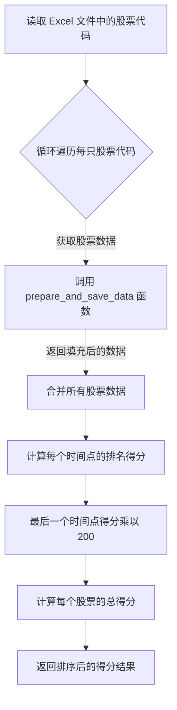

在金融领域，量化分析是利用数学和统计方法对金融市场进行分析和交易决策的过程。近年来，随着计算机科学和数据科学的发展，量化交易成为了金融领域的一个重要分支。本文将探讨如何使用 Python 和掘金量化 API 来实现一个简单的量化分析工具，该工具能够通过分析 Excel 中列出的股票的开盘集合竞价数据来计算它们的强弱表现排名。

### 掘金量化简介

掘金量化是一个为量化交易者提供全面数据、工具和策略开发环境的平台。它允许用户获取历史和实时市场数据，进行策略开发和回测，并可能连接到交易所进行真实交易。

### 实现股票表现排名工具

本文介绍的工具通过分析股票在开盘集合竞价阶段的表现来计算它们的强弱排名。集合竞价是股票市场中用于确定开盘价格的一种机制，通过在开盘前的一段时间内收集所有买卖订单来确定开盘价。

### 流程图



### 部分代码

```python
# coding=utf-8
from __future__ import print_function, absolute_import
from gm.api import *
import pandas as pd
from email.mime.text import MIMEText
from datetime import datetime, timedelta
import os


# 掘金量化，通过excel表中自选的股票代码，获取开盘集合竞价每3秒钟的数据，然后对数据进行排名加权，计算加权后的强弱表现排名
def prepare_and_save_data(symbol):
    data = get_instruments(symbols=symbol, df=True)[['pre_close', 'sec_name']]
    pre_close_value = data['pre_close'].iloc[0]
    sec_name_value = data['sec_name'].iloc[0]

    # 获取当前日期的前一天
    # current_date = datetime.now().date() - timedelta(days=2)
    # 获得今日日期
    current_date = datetime.now().date()
    # 将日期转换为字符串
    date_str = current_date.strftime('%Y-%m-%d')

    # 插入到start_time和end_time
    df = history(symbol=symbol, frequency='tick', start_time=date_str + ' 09:15:00', end_time=date_str + ' 09:25:00', fields='', adjust=ADJUST_PREV, df=True)

    # print(df)
    # 打印数据的表头
    # print(df.columns)
    # 定义需要添加到每个 quotes DataFrame 中的列
    additional_columns = ['created_at', 'open', 'cum_volume']

    # 为每行中的 quotes 创建一个 DataFrame，并添加额外的列
    quotes_dfs = []
    for index, row in df.iterrows():
        quotes_df = pd.DataFrame(row['quotes'])
        for col in additional_columns:
            quotes_df[col] = row[col]
        quotes_dfs.append(quotes_df)

    # 合并所有的 quotes DataFrame
    all_quotes_df = pd.concat(quotes_dfs, ignore_index=True)
    # 根据时间列进行分组，并取每组的第一行
    first_rows = all_quotes_df.groupby('created_at').first().reset_index()
    # 时间转换为没有时区的时间
    first_rows['created_at'] = pd.to_datetime(first_rows['created_at']).dt.tz_localize(None)

    # 计算从 start_time 开始每3秒钟的时间序列
    start_time = pd.to_datetime(date_str + ' 09:15:00')
    end_time = pd.to_datetime(date_str + ' 09:25:00')
    # end_time = first_rows['created_at'].max()
    time_series = pd.date_range(start=start_time, end=end_time, freq='3S')

    # 重建 DataFrame，使用新的时间序列为索引，并前向填充数据
    first_rows.set_index('created_at', inplace=True)
    filled_first_rows = first_rows.reindex(time_series, method='ffill').fillna(0).reset_index()
    filled_first_rows.rename(columns={'index': 'created_at'}, inplace=True)

    # 将symbol增加到表中
    filled_first_rows['symbol'] = symbol
    # 添加 pre_close 列和计算 change_ratio 列
    filled_first_rows['pre_close'] = pre_close_value
    filled_first_rows['sec_name'] = sec_name_value
    filled_first_rows['change_ratio'] = (filled_first_rows['ask_p'] - filled_first_rows['pre_close']) / filled_first_rows['pre_close']
    # filled_first_rows.loc[filled_first_rows.index[-1], 'change_ratio'] = (filled_first_rows.loc[filled_first_rows.index[-1], 'open'] - pre_close_value) / pre_close_value

    return filled_first_rows  # 返回填充后的数据


```

### 数据准备和保存

工具首先定义了 prepare_and_save_data 函数，用于获取指定股票的开盘集合竞价数据。该函数接收股票代码作为参数，并通过掘金量化 API 获取股票的前收盘价和名称，然后获取股票在开盘前的特定时间段内的 tick 数据。

函数接着处理这些数据，计算从开盘前一段时间开始每 3 秒钟的数据点，并计算每个数据点的变化率（相对于前一天的收盘价）。处理后的数据将用于后续的排名和分析。

### 计算排名和分数

calculate_scores 函数负责读取 Excel 文件中列出的股票代码，对每个股票调用 prepare_and_save_data 函数获取处理后的数据，并计算每个时间点的排名。排名是根据股票在每个时间点的变化率来计算的，变化率越高的股票排名越靠前。

最终，该函数计算每个股票在最后一个时间点的分数，并将这些分数乘以一个系数（在本例中为 200），以便于进一步分析。

### 结果展示

处理完所有股票后，calculate_scores 函数会打印出每个股票的总分数，并按照分数进行降序排列，从而可以直观地看到哪些股票在开盘集合竞价阶段表现较强。

### 结论

通过本工具，量化交易者可以快速地分析和比较不同股票在市场开盘时的表现，从而为交易决策提供数据支持。这种方法虽然简单，但能有效地揭示市场开盘时的动态和趋势，对于短线交易和开盘策略的制定尤为重要。

### 下载或阅读内容为付费内容，金额为：9.90

该内容与微信公众号的付费阅读和本站点的“付费阅读”绑定：

1. 公众号的付费阅读可以直接获得下载或阅读内容，关注微信公众号：余汉波-文章视频-付费阅读，找到对应的内容，或跳转至：使用 Python 和掘金量化 API 实现股票开盘强弱排名工具
1. 扫描打赏二维码，打赏指定金额，截图+标题发送至邮箱（yuhanbo@sanrenjz.com），或发送到微信（yuhanbo758），等待回复的付费阅读密码：使用Python和掘金量化API实现股票开盘强弱排名工具 | 余汉波 文档


