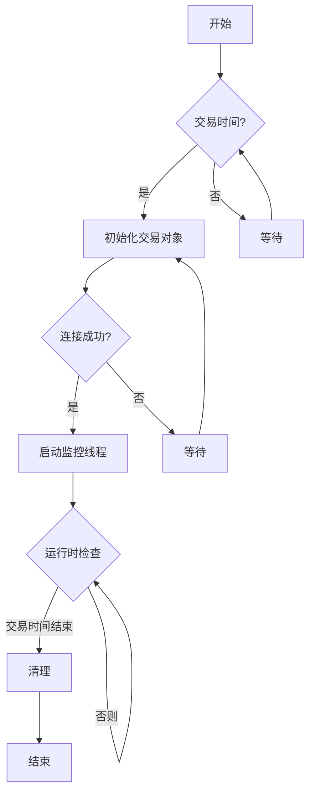
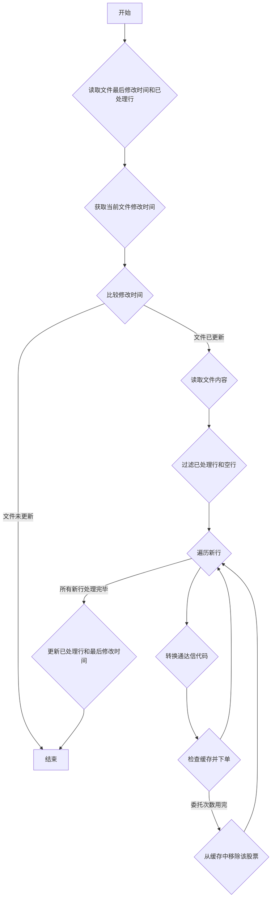

本文将深入探讨一个基于 Python 的通达信自动交易系统，旨在解决通达信交易软件中 2% 价格笼子的限制，实现更灵活的打板策略。该系统通过监控通达信输出的股票代码文件，实时进行买入或卖出操作，并集成了订单管理、错误处理和邮件通知等功能。

### 一、 系统目标与功能

通达信自动交易系统的核心目标是自动化执行股票交易策略，特别是打板策略。打板策略通常需要在极短时间内完成交易，而通达信软件的 2% 价格笼子限制可能会导致无法以理想价格成交。该系统通过绕过此限制，直接与券商交易接口交互，实现更精准的委托价格和更快的成交速度。

系统主要功能包括：

1. 实时监控文件变动: 系统持续监控通达信软件输出的包含股票代码的文件，一旦文件内容发生变化，即触发交易逻辑。
1. 通达信代码转换: 将通达信格式的股票代码转换为标准证券代码格式，例如将 000001 转换为 000001.SZ。
1. 下单交易: 根据设定的交易策略和参数，自动向券商服务器发送委托指令，进行买入或卖出操作。
1. 订单管理:  系统能够查询、撤销未成交订单，避免重复下单。
1. 资金和持仓管理:  在买入前检查可用资金，在卖出前检查可用持仓，确保交易的合法性。
1. 错误处理和邮件通知: 系统具备完善的错误处理机制，并在发生错误时通过邮件通知用户。
1. 定时任务调度: 利用 APScheduler 库实现定时任务调度，确保系统稳定运行。
### 二、 代码结构与组织

系统代码采用模块化设计，主要分为以下几个部分：

1. 配置模块 (config.py): 存储系统配置参数，例如券商接口路径、账户信息、监控文件路径等。
1. 交易接口模块 (xtquant): 封装了与券商交易接口的交互逻辑，提供下单、查询、撤单等功能。
1. 回调函数模块 (MyXtQuantTraderCallback): 定义了处理交易接口推送信息的回调函数，例如成交回报、委托回报等。
1. 下单函数 (place_orders): 封装了下单逻辑，包括参数校验、订单类型转换、资金和持仓检查等。
1. 文件监控函数 (monitor_file): 负责监控通达信输出的文件，并触发交易逻辑。
1. 定时任务调度模块 (schedule_jobs): 使用 APScheduler 库创建和管理定时任务。
1. 主程序模块: 负责初始化交易接口、连接券商服务器、启动定时任务等。

### 三、 算法与数据结构

系统主要使用以下算法和数据结构：

1. 文件监控算法: 通过比较文件的最后修改时间来判断文件是否发生变化。
1. 订单缓存 (order_cache): 使用字典存储每个股票的委托信息，包括剩余委托次数、当前持仓、其他策略持仓等。
1. 持仓字典 (positions_dict): 使用字典存储当前账户的持仓信息，方便快速查询。
### 四、 复杂与不寻常的方面

1. 撤单逻辑:  在下单前，系统会先查询未成交订单并进行撤单，避免重复下单。
1. 资金和持仓检查:  系统在买入前检查可用资金，在卖出前检查可用持仓，确保交易的合法性，避免因资金或持仓不足导致交易失败。
1. 委托数量调整: 系统会根据证券类型（股票、可转债）将委托数量调整为正确的倍数。
1. 最优五档和对手方最优价格: 系统支持使用最优五档和对手方最优价格进行下单，提高成交效率。
### 五、 潜在限制与改进建议

1. 单点故障:  系统依赖于单一的通达信文件和交易接口，如果其中任何一个出现故障，可能会导致系统瘫痪。建议增加冗余机制，例如多文件监控或多接口切换。

2. 交易策略单一:  目前系统只支持简单的打板策略，可以考虑扩展支持更多复杂的交易策略。
3. 风险管理: 系统缺乏风险管理机制，例如止损和止盈。建议增加相应的风险控制功能。

https://tse1.mm.bing.net/th/id/OIG3.RgSvZ.7vnlKIqliHSDnZ

### 六、 编程语言与库

系统使用 Python 编程语言，并依赖于以下库：

1. xtquant:  券商提供的交易接口库。
1. APScheduler:  定时任务调度库。
1. datetime:  时间处理库。
1. os:  操作系统接口库。
1. time:  时间库。
1. threading:  多线程库。
1. math: 数学库。
1. send_email: 自定义邮件发送库。
### 七、 代码流程图 (Mermaid)

整个系统的流程图

监控通达信文件变动

总而言之，该通达信自动交易系统提供了一个高效的解决方案，帮助交易者克服通达信软件的限制，实现自动化打板策略。然而，系统仍存在一些潜在的限制，需要进一步改进和完善，以提高其稳定性和可靠性。 通过本文的分析，读者可以更深入地理解系统的运作机制，并根据自身需求进行定制和优化。

### 代码

### 下载或阅读完整内容为付费内容，金额为：49.90

该内容与微信公众号的付费阅读和本站点的“付费阅读”绑定：

1. 公众号的付费阅读可以直接获得下载或阅读内容，关注微信公众号：余汉波-文章视频-付费阅读，找到对应的内容，或跳转至：QMT打造通达信自动交易系统：突破2%价格笼子限制
1. 扫描打赏二维码，打赏指定金额，截图+标题发送至邮箱（yuhanbo@sanrenjz.com），或发送到微信（yuhanbo758），等待回复的付费阅读密码：Python打造通达信自动交易系统：突破2%价格笼子限制 | 余汉波 文档

