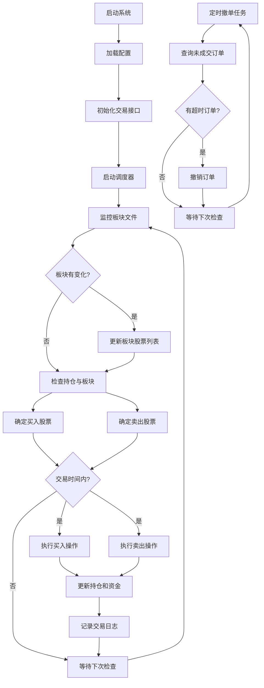

[（加密）QMT与同花顺结合：动态板块监控交易 | 三人聚智-余汉波程序小店](https://jy.sanrenjz.com/buy/19)

[（非加密）QMT与同花顺结合：动态板块监控交易 | 三人聚智-余汉波程序小店](https://jy.sanrenjz.com/buy/20)

注：如果是使用 VBS 打开程序的话，首先要确保安装了apscheduler 和xtquant 两个库。如果是小白的话，还是建议使用这边一个程序控制[小白Python工具：三人聚智-余汉波程序控制工具使用说明 | 余汉波 文档](https://wd.sanrenjz.com/%E4%BB%A3%E7%A0%81%E4%B8%8E%E6%95%88%E7%8E%87/%E4%B8%89%E4%BA%BA%E8%81%9A%E6%99%BA-%E4%BD%99%E6%B1%89%E6%B3%A2%E7%A8%8B%E5%BA%8F%E6%8E%A7%E5%88%B6%E5%B7%A5%E5%85%B7%E4%BD%BF%E7%94%A8%E8%AF%B4%E6%98%8E)，xtquant量化库已经安装，其他库会自动安装。

在当今快节奏的金融市场中，量化交易已成为投资者提高效率和精准度的重要工具。本文将深入解析一个基于同花顺板块的自动交易系统，该系统能够自动监控同花顺自定义板块的变化，并根据预设策略执行买入与卖出操作。

这篇文章面向具有一定技术背景但非专业程序员的读者，旨在帮助您理解系统的工作原理、架构设计和核心算法。

## 1. 系统概述与技术栈

同花顺板块自动交易系统是一款基于Python开发的量化交易工具，它通过监控同花顺软件中用户自定义的板块变化，自动执行相应的交易策略。系统采用图形用户界面(GUI)设计，便于用户操作和监控交易过程。

主要技术栈：

* 编程语言：Python
* GUI框架：Tkinter
* 交易接口：XtQuant API（量化交易接口）
* 任务调度：APScheduler（高级Python调度器）
* 其他库：datetime, threading, json, os等Python标准库
## 2. 系统架构与模块组织

系统采用面向对象的设计方法，主要包含以下核心组件：

1. TongHuaShunTrader类：系统的主类，负责GUI界面创建、交易逻辑实现和状态管理
1. MyXtQuantTraderCallback类：交易回调处理类，处理委托回报、成交回报等交易事件
1. read_block模块：负责读取同花顺板块文件，获取板块内的股票列表
系统的整体架构遵循MVC（模型-视图-控制器）设计模式：

* 模型(Model)：交易数据和状态管理
* 视图(View)：Tkinter构建的GUI界面
* 控制器(Controller)：交易逻辑和事件处理


## 3. 核心功能与实现逻辑

### 3.1 GUI界面设计

系统使用Tkinter构建了一个直观的用户界面，包含以下主要部分：

* 路径设置区：配置证券账号、同花顺板块目录和QMT报单目录
* 交易参数区：设置板块名称、保留资金、交易时间、委托类型等参数
* 按钮区：包含保存参数、清空日志、开始/停止交易等功能按钮
* 日志区：实时显示交易系统的运行状态和交易信息
GUI的实现采用了网格布局(grid)，通过Frame和LabelFrame组织不同功能区域，使界面结构清晰、操作便捷。

```python
def create_gui(self):
    # 创建主框架
    main_frame = ttk.Frame(self.root, padding="5")
    main_frame.grid(row=0, column=0, sticky=(tk.W, tk.E, tk.N, tk.S))
    
    # 路径设置区域
    path_frame = ttk.LabelFrame(main_frame, text="路径设置", padding="3")
    path_frame.grid(row=0, column=0, columnspan=2, sticky=(tk.W, tk.E), padx=3, pady=3)
    
    # 交易参数区域
    trade_frame = ttk.LabelFrame(main_frame, text="交易参数", padding="3")
    trade_frame.grid(row=1, column=0, columnspan=2, sticky=(tk.W, tk.E), padx=3, pady=3)
    
    # 按钮区域和日志区域...
```

### 3.2 板块监控与交易逻辑

系统的核心功能是监控同花顺板块变化并执行交易，这一功能主要通过monitor_file方法实现：

1. 板块监控：系统定期读取同花顺板块文件，获取板块内的股票列表
1. 变化检测：比较当前板块股票与上次记录的股票列表，检测变化
1. 交易决策：根据板块变化和持仓情况，决定需要买入或卖出的股票
1. 交易执行：调用place_buy_order和place_sell_order方法执行具体的交易操作
```python
def monitor_file(self, block_name):
    # 获取同花顺板块的股票代码
    current_block_stocks = set(get_stocks_by_block_name(block_name, ths_path))
    
    # 检查板块内容是否有变化
    if current_block_stocks != self.last_block_stocks:
        # 处理板块变化...
    
    # 获取当前持仓和未成交委托
    positions = self.xt_trader.query_stock_positions(acc)
    pending_orders = self.xt_trader.query_stock_orders(acc, True)
    
    # 决定买入和卖出的股票
    stocks_to_buy = set()  # 需要买入的股票
    stocks_to_sell = set() # 需要卖出的股票
    
    # 执行买入和卖出操作
    for stock_code in stocks_to_buy:
        self.place_buy_order(stock_code, available_money, reserve_money)
    
    for stock_code in stocks_to_sell:
        self.place_sell_order(stock_code)
```

### 3.3 买入和卖出策略

系统实现了智能的买入和卖出策略，主要考虑以下因素：

买入策略：

* 持仓市值低于目标金额的股票
* 交易间隔控制，避免频繁交易
* 资金管理，确保不超过可用资金
* 根据证券类型调整委托数量（股票按100股，可转债按10张）
卖出策略：

* 不在板块中的持仓股票
* 持仓市值超过目标金额的股票
* 交易间隔控制
* 分批卖出，控制单次卖出金额
买入和卖出操作都支持多种委托方式，包括限价、最优五档、对手方最优等，并针对可转债做了特殊处理。


### 3.4 日志管理与错误处理

系统实现了完善的日志管理和错误处理机制：

* 日志分级：通过log_message和log_periodic方法实现不同级别的日志输出
* 定期日志：对于频繁重复的日志，采用定期输出策略，减少日志冗余
* 错误捕获：使用try-except结构捕获各类异常，确保系统稳定运行
* 日志过滤：过滤掉不必要的日志信息，如"买入数量无效"等
```python
def log_message(self, message, level="INFO"):
    # 过滤掉不需要记录的日志
    if "买入数量无效" in message or "计算买入金额" in message:
        return
        
    current_time = datetime.now().strftime("%Y-%m-%d %H:%M:%S")
    self.log_text.insert(tk.END, f"[{current_time}] {message}\n")
    self.log_text.see(tk.END)
    
def log_periodic(self, message, level="INFO"):
    current_time = datetime.now()
    # 如果距离上次日志输出时间超过设定的间隔，则输出日志
    if (current_time - self.last_log_time).total_seconds() >= self.log_interval:
        self.log_message(message, level)
        self.last_log_time = current_time
```

## 4. 任务调度与并发处理

系统使用APScheduler库实现任务调度，主要包括两类任务：

1. 板块监控任务：每秒执行一次，检查板块变化并执行交易
1. 撤单任务：每10秒执行一次，检查并撤销超过10秒未成交的订单
为了提高系统性能，调度器配置了线程池和进程池：

```python
executor_config = {
    'executors': {
        'default': ThreadPoolExecutor(max_workers=20),
        'processpool': ProcessPoolExecutor(max_workers=5)
    },
    'job_defaults': {
        'coalesce': True,
        'max_instances': 3
    }
}

self.scheduler = BackgroundScheduler(executor_config)
```

系统还使用了线程来处理交易循环，确保GUI界面保持响应：

```python
self.trading_thread = threading.Thread(target=self.trading_loop, daemon=True)
self.trading_thread.start()
```

## 5. 数据结构与算法分析

系统中使用了多种数据结构来管理交易状态和决策：

* 集合(set)：用于存储板块股票和需要交易的股票，便于快速查找和比较
* 字典(dict)：用于存储持仓信息、最新价格和交易时间等
* 列表(list)：用于存储和展示股票信息
核心算法包括：

1. 板块变化检测算法：使用集合操作(差集、交集)快速检测板块变化
1. 交易决策算法：基于持仓市值、目标金额和交易间隔等因素决定交易操作
1. 资金分配算法：根据单笔金额、总金额和可用资金计算交易数量
1. 日志优化算法：通过时间间隔控制和消息合并减少日志输出频率
## 6. 系统限制与改进建议

尽管系统功能完善，但仍存在一些限制和可改进之处：

系统限制：

1. 依赖外部软件：需要同花顺软件和QMT交易端
1. 交易接口限制：仅支持XtQuant交易接口，不支持其他券商接口
1. 错误恢复机制：缺乏完善的错误恢复和断点续传机制
1. 性能瓶颈：频繁查询行情和持仓可能导致性能问题
改进建议：

1. 多策略支持：增加更多交易策略选项，如均线策略、动量策略等
1. 回测功能：添加策略回测功能，评估策略历史表现
1. 多账户支持：支持多个交易账户同时操作
1. 数据持久化：增加交易记录数据库存储和分析功能
1. 风险控制：增强风险控制机制，如止损止盈、波动率控制等
1. API扩展：支持更多交易接口，如通达信、同花顺等
## 7. 系统流程图



## 8. 总结

同花顺板块自动交易系统是一个功能完善的量化交易工具，它通过监控同花顺板块变化，自动执行买入和卖出操作，帮助投资者实现投资自动化。系统采用面向对象设计，结构清晰，逻辑严谨，具有良好的可扩展性和可维护性。

系统的核心价值在于将人工判断转化为自动化流程，减少人为干预，严格执行交易纪律。通过合理的资金管理和交易间隔控制，系统能够有效控制风险，提高投资效率。

对于有一定技术背景的投资者，理解并使用这样的系统，不仅能够提高投资效率，还能加深对量化交易的理解，为进一步开发和优化交易策略奠定基础。

