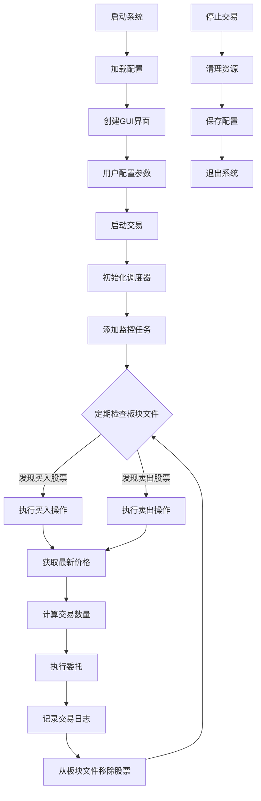
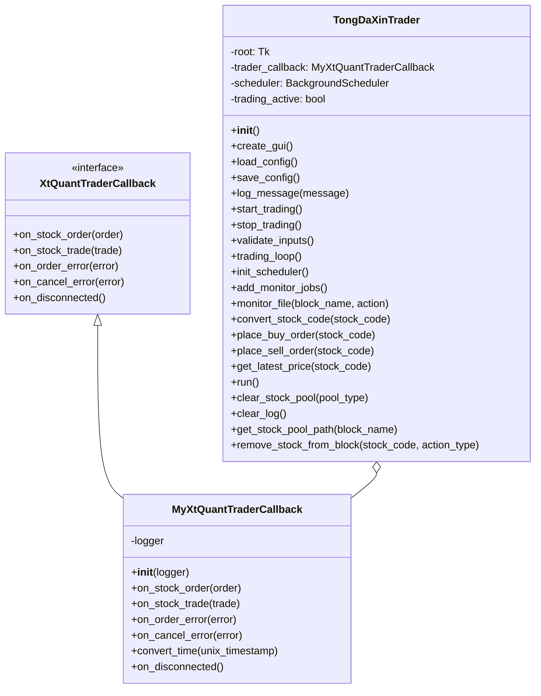

视频：[QMT与通达信结合 4.0：监测交易系统，通达信公式自动交易系统_哔哩哔哩_bilibili](https://www.bilibili.com/video/BV1AmRKYqErd/?vd_source=247ac77d4ae7339ea06d0fec09aa8f70)

[（加密）QMT与通达信结合 4.0：监测交易系统，通达信公式自动交易系统 | 三人聚智-余汉波程序小店](https://jy.sanrenjz.com/buy/8)

[（非加密）QMT与通达信结合 4.0：监测交易系统，通达信公式自动交易系统 | 三人聚智-余汉波程序小店](https://jy.sanrenjz.com/buy/9)

## 4.0 版本更新

1. 主要增加了“卖出委托类型”功能选项“最优五档转限价”。该委托功能解决“最优五档”（最优五档即时成交剩余撤销）遇涨停或跌停无法委托的缺陷，可先检查是否涨停或跌停，若非涨跌停，以最优五档进委委托；若涨跌停，以最新价进行委托。
1. 自己部署 python 环境的话，设置等跟其他版本一致：需要安装两个库，xtquant 和 apscheduler，其他的是标准库，不需安装。 xtquant 是小 QMT 的数据获取和交易的库，不支持通过 pip 安装，可以到官网 [xtquant版本下载 | 迅投知识库 (thinktrader.net)](https://dict.thinktrader.net/nativeApi/download_xtquant.html?id=Xb4724) 自行下载，然后放到你 python 安装所在的 site-packages 文件夹内。apscheduler 库可以通过 pip 安装，国内镜像可以使用 pip install apscheduler -i https://pypi.tuna.tsinghua.edu.cn/simple。
1. 若使用[小白Python工具：三人聚智-余汉波程序控制工具使用说明 | 余汉波 文档](https://wd.sanrenjz.com/%E4%BB%A3%E7%A0%81%E4%B8%8E%E6%95%88%E7%8E%87/%E4%B8%89%E4%BA%BA%E8%81%9A%E6%99%BA-%E4%BD%99%E6%B1%89%E6%B3%A2%E7%A8%8B%E5%BA%8F%E6%8E%A7%E5%88%B6%E5%B7%A5%E5%85%B7%E4%BD%BF%E7%94%A8%E8%AF%B4%E6%98%8E)，下载 yuhanbopy-lh，然后通过“本地文件”加载进来，便可以直接使用，不用作任何配置。
1.0 版本视频请前往： [QMT与通达信结合，实现专属量化交易：通达信自动交易系统_哔哩哔哩_bilibili](https://www.bilibili.com/video/BV1wDBvYgEML/?vd_source=247ac77d4ae7339ea06d0fec09aa8f70)

1.0 版本文章请前往：[QMT与通达信结合，实现专属量化交易：通达信自动交易系统 | 余汉波 文档](https://wd.sanrenjz.com/%E4%BB%A3%E7%A0%81%E4%B8%8E%E6%95%88%E7%8E%87/QMT%E4%B8%8E%E9%80%9A%E8%BE%BE%E4%BF%A1%E7%BB%93%E5%90%88%EF%BC%8C%E5%AE%9E%E7%8E%B0%E4%B8%93%E5%B1%9E%E9%87%8F%E5%8C%96%E4%BA%A4%E6%98%93%EF%BC%9A%E9%80%9A%E8%BE%BE%E4%BF%A1%E8%87%AA%E5%8A%A8%E4%BA%A4%E6%98%93%E7%B3%BB%E7%BB%9F)

2.0 版本视频请前往： [QMT与通达信结合2.0，监测交易系统：通达信自动交易系统_哔哩哔哩_bilibili](https://www.bilibili.com/video/BV1F6iUYqEmf/?vd_source=247ac77d4ae7339ea06d0fec09aa8f70)

2.0 版本文章请前往：[QMT与通达信结合2.0，监测交易系统：通达信自动交易系统 | 余汉波 文档](https://wd.sanrenjz.com/%E4%BB%A3%E7%A0%81%E4%B8%8E%E6%95%88%E7%8E%87/QMT%E4%B8%8E%E9%80%9A%E8%BE%BE%E4%BF%A1%E7%BB%93%E5%90%882.0%EF%BC%8C%E7%9B%91%E6%B5%8B%E4%BA%A4%E6%98%93%E7%B3%BB%E7%BB%9F%EF%BC%9A%E9%80%9A%E8%BE%BE%E4%BF%A1%E8%87%AA%E5%8A%A8%E4%BA%A4%E6%98%93%E7%B3%BB%E7%BB%9F)

3.0 版本文章请前往：[QMT与通达信结合3.0，监测交易系统：通达信公式自动交易系统 | 余汉波 文档](https://wd.sanrenjz.com/%E4%BB%A3%E7%A0%81%E4%B8%8E%E6%95%88%E7%8E%87/QMT%E4%B8%8E%E9%80%9A%E8%BE%BE%E4%BF%A1%E7%BB%93%E5%90%883.0%EF%BC%8C%E7%9B%91%E6%B5%8B%E4%BA%A4%E6%98%93%E7%B3%BB%E7%BB%9F%EF%BC%9A%E9%80%9A%E8%BE%BE%E4%BF%A1%E5%85%AC%E5%BC%8F%E8%87%AA%E5%8A%A8%E4%BA%A4%E6%98%93%E7%B3%BB%E7%BB%9F)

3.0 版本视频请前往： [QMT与通达信结合3.0，监测交易系统：通达信公式自动交易系统_哔哩哔哩_bilibili](https://www.bilibili.com/video/BV1cZkuY5ErU/?vd_source=247ac77d4ae7339ea06d0fec09aa8f70)

在当今快节奏的金融市场中，自动化交易系统已成为投资者的重要工具。本文将深入解析一个基于通达信和国金QMT的自动化交易系统的代码实现，帮助读者理解其工作原理、架构设计和核心功能。

## 1. 系统概述

通达信智能交易助手是一个将通达信行情软件与国金QMT交易系统相结合的自动化交易工具。该系统主要通过监控通达信的板块文件变化，自动执行相应的买入或卖出操作，实现无人值守的自动化交易。

### 1.1 系统核心功能

* 自动监控通达信板块文件变化
* 根据板块变化执行买入或卖出操作
* 支持多种委托方式和价格策略
* 智能资金管理和风险控制
* 完整的日志记录系统
* 图形用户界面操作
## 2. 代码结构分析

系统主要由两个核心类组成：MyXtQuantTraderCallback和TongDaXinTrader。

### 2.1 回调处理类：MyXtQuantTraderCallback

MyXtQuantTraderCallback类继承自XtQuantTraderCallback，负责处理交易过程中的各种回调事件：

```python
class MyXtQuantTraderCallback(XtQuantTraderCallback):
    def __init__(self, logger):
        # 初始化回调处理器，接收日志记录器
        
    def on_stock_order(self, order):
        # 处理股票订单回调
        
    def on_stock_trade(self, trade):
        # 处理股票成交回调
        
    def on_order_error(self, order_error):
        # 处理订单错误回调
        
    def on_cancel_error(self, cancel_error):
        # 处理撤单错误回调
        
    def convert_time(self, unix_timestamp):
        # 转换Unix时间戳为可读时间格式
        
    def on_disconnected(self):
        # 处理断开连接事件
```

这个类的主要职责是接收交易系统的各种事件通知，并进行相应处理，如记录日志、更新交易状态等。


### 2.2 主交易类：TongDaXinTrader

TongDaXinTrader类是系统的核心，负责创建GUI界面、初始化交易环境、监控板块文件、执行交易操作等：

```python
class TongDaXinTrader:
    def __init__(self):
        # 初始化交易系统
        
    def create_gui(self):
        # 创建图形用户界面
        
    def load_config(self):
        # 加载配置信息
        
    def save_config(self):
        # 保存配置信息
        
    def log_message(self, message):
        # 记录日志信息
        
    def start_trading(self):
        # 启动交易系统
        
    def stop_trading(self):
        # 停止交易系统
```

## 3. 核心功能实现详解

### 3.1 板块文件监控机制

系统通过定时任务监控通达信的板块文件变化，这是自动交易的触发机制：

```python
def init_scheduler(self):
    """初始化定时任务调度器"""
    self.scheduler = BackgroundScheduler()
    self.scheduler.start()
    
def add_monitor_jobs(self):
    """添加监控任务"""
    # 添加买入监控任务
    buy_block = self.get_entry_value(self.buy_pool_entry, "示例：BUY")
    if buy_block:
        self.scheduler.add_job(
            self.monitor_file,
            'interval',
            seconds=int(self.get_entry_value(self.monitor_interval_entry, "10")),
            args=[buy_block, "buy"]
        )
    
    # 添加卖出监控任务
    # 类似代码...
```

monitor_file方法是监控的核心，它会检查板块文件的变化，并触发相应的交易操作：

```python
def monitor_file(self, block_name, action):
    """监控板块文件变化并执行相应操作"""
    try:
        # 获取板块文件路径
        file_path = self.get_stock_pool_path(block_name)
        if not file_path or not os.path.exists(file_path):
            return
            
        # 读取板块文件内容
        with open(file_path, 'r', encoding='gbk', errors='ignore') as f:
            content = f.read()
            
        # 解析股票代码
        stock_codes = []
        for line in content.split('\n'):
            line = line.strip()
            if line and not line.startswith('#'):
                stock_codes.append(line)
                
        # 执行交易操作
        if action == "buy":
            for stock_code in stock_codes:
                self.place_buy_order(stock_code)
        else:
            for stock_code in stock_codes:
                self.place_sell_order(stock_code)
                
    except Exception as e:
        self.log_message(f"监控文件异常: {str(e)}")
```


### 3.2 股票路径处理

系统需要正确处理通达信的文件路径，以便读取板块文件：

```python
def get_stock_pool_path(self, block_name):
    """根据通达信目录和板块名称生成完整的股票池文件路径"""
    try:
        tdx_base_path = self.get_entry_value(self.tdx_path_entry, "示例：D:\\jiaoyi\\gxtdx")
        if not tdx_base_path:
            raise ValueError("通达信程序目录未设置")
        
        # 如果用户输入了.blk后缀，则去掉
        block_name = block_name.replace('.blk', '')
        
        # 构建完整路径，添加固定的子目录结构
        full_path = os.path.join(tdx_base_path, 'T0002', 'blocknew', f'{block_name}.blk')
        return full_path
    except Exception as e:
        self.log_message(f"生成股票池路径失败: {str(e)}")
        return None
```

### 3.3 交易执行逻辑

买入和卖出操作是系统的核心功能，下面以买入操作为例：

```python
def place_buy_order(self, stock_code):
    """执行买入操作"""
    try:
        # 转换股票代码格式
        formatted_code = self.convert_stock_code(stock_code)
        if not formatted_code:
            return
            
        # 获取最新价格
        latest_price = self.get_latest_price(formatted_code)
        if not latest_price:
            return
            
        # 计算买入数量
        # 根据资金管理策略计算买入股数
        
        # 执行买入委托
        # 根据不同的委托方式执行买入
        
        # 记录买入操作
        self.log_message(f"买入委托: {formatted_code}, 价格: {price}, 数量: {quantity}")
        
        # 从监控板块中移除该股票
        self.remove_stock_from_block(stock_code, "buy")
        
    except Exception as e:
        self.log_message(f"买入委托异常: {str(e)}")
```

### 3.4 用户界面交互

系统提供了图形用户界面，方便用户配置和操作：

```python
def create_gui(self):
    """创建图形用户界面"""
    # 创建主窗口
    self.root = tk.Tk()
    self.root.title("通达信板块自动交易系统")
    self.root.geometry("800x600")
    
    # 创建各种配置框、按钮和日志区域
    # ...
    
    # 设置默认值和加载配置
    self.load_config()
```

用户界面包含多个输入框，系统提供了一系列方法来处理输入框的默认值和实际值：

```python
def on_entry_click(self, entry, default_text):
    """处理输入框点击事件，清除默认提示文本"""
    if entry.get() == default_text:
        entry.delete(0, tk.END)
        entry.config(foreground='black')

def on_focus_out(self, entry, default_text):
    """处理输入框失去焦点事件，如果为空则显示默认提示文本"""
    if not entry.get():
        entry.insert(0, default_text)
        entry.config(foreground='gray')

def set_entry_value(self, entry, value, default_text=None):
    """设置输入框的值，处理默认提示文本的显示"""
    if value:
        entry.delete(0, tk.END)
        entry.insert(0, value)
        entry.config(foreground='black')
    elif default_text:
        entry.delete(0, tk.END)
        entry.insert(0, default_text)
        entry.config(foreground='gray')

def get_entry_value(self, entry, default_text):
    """获取输入框的实际值，如果是默认提示文本则返回空字符串"""
    value = entry.get()
    return '' if value == default_text else value
```

## 4. 系统工作流程

整个系统的工作流程可以概括为以下几个步骤：

1. 用户配置通达信路径、买入/卖出板块、交易参数等
1. 启动交易系统，初始化调度器和监控任务
1. 系统定期检查板块文件变化
1. 发现新的股票代码时，执行相应的买入或卖出操作
1. 交易完成后，从板块文件中移除该股票代码
1. 记录交易日志，更新界面显示
## 5. 使用的编程语言和库

系统主要使用Python语言开发，涉及以下库和模块：

* tkinter: 用于创建图形用户界面
* os: 处理文件路径和系统操作
* json: 处理配置文件的读写
* datetime: 处理日期和时间
* threading: 实现多线程操作
* time: 处理时间延迟和计时
* random: 生成随机数
* xtquant: 国金量化交易接口
* apscheduler: 任务调度器，用于定时监控
## 6. 系统的潜在限制和改进建议

### 6.1 潜在限制

1. 依赖外部软件: 系统依赖通达信和国金QMT，如果这些软件升级或接口变更，可能导致系统失效。
1. 错误处理: 当前的错误处理机制较为简单，可能无法应对复杂的异常情况。
1. 并发控制: 在高频交易场景下，可能存在并发问题。
1. 安全性: 缺乏对交易指令的二次验证机制。
### 6.2 改进建议

1. 增强错误恢复机制: 实现更完善的错误处理和自动恢复功能。
1. 优化监控机制: 使用文件系统事件通知替代定时轮询，提高响应速度和效率。
1. 增加回测功能: 集成回测模块，允许用户在实盘前验证策略有效性。
1. 增强风控功能: 实现更复杂的风险控制策略，如波动率控制、最大回撤限制等。
1. 数据持久化: 使用数据库存储交易记录，便于后续分析和优化。
## 7. 总结

通达信智能交易助手是一个将传统交易软件与现代量化交易技术相结合的系统，通过自动化监控和交易执行，帮助投资者提高交易效率，减少人为干预。系统设计合理，功能完善，但仍有优化空间。对于有一定技术背景的投资者来说，理解并使用这样的系统，可以显著提升交易体验和效率。

## 流程图



## 类图



通过本文的详细解析，读者应该能够全面理解通达信智能交易助手的代码结构、工作原理和核心功能，为进一步学习和应用量化交易技术打下基础。

