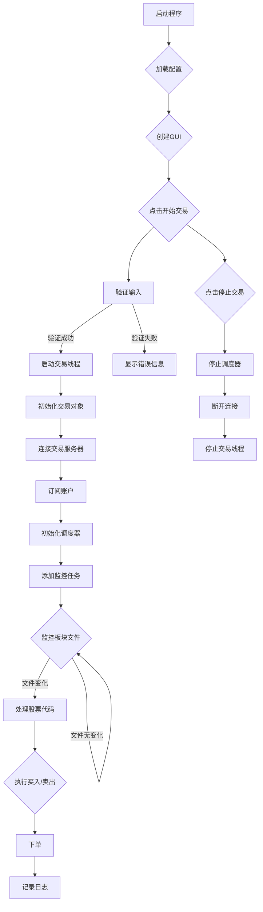

本文将深入剖析一个基于 Python 的通达信板块自动交易程序。该程序旨在监控通达信软件的板块文件，并根据板块内股票的变化自动进行买入或卖出操作。它利用 xtquant 库连接券商交易接口，实现自动化交易，并通过图形用户界面 (GUI) 提供用户友好的配置和监控体验。

1.0 版本视频请前往： [QMT与通达信结合，实现专属量化交易：通达信自动交易系统_哔哩哔哩_bilibili](https://www.bilibili.com/video/BV1wDBvYgEML/?vd_source=247ac77d4ae7339ea06d0fec09aa8f70)

1.0 版本文章请前往：[QMT与通达信结合，实现专属量化交易：通达信自动交易系统 | 余汉波 文档](https://wd.sanrenjz.com/%E4%BB%A3%E7%A0%81%E4%B8%8E%E6%95%88%E7%8E%87/QMT%E4%B8%8E%E9%80%9A%E8%BE%BE%E4%BF%A1%E7%BB%93%E5%90%88%EF%BC%8C%E5%AE%9E%E7%8E%B0%E4%B8%93%E5%B1%9E%E9%87%8F%E5%8C%96%E4%BA%A4%E6%98%93%EF%BC%9A%E9%80%9A%E8%BE%BE%E4%BF%A1%E8%87%AA%E5%8A%A8%E4%BA%A4%E6%98%93%E7%B3%BB%E7%BB%9F)

2.0 版本视频请前往： [QMT与通达信结合2.0，监测交易系统：通达信自动交易系统_哔哩哔哩_bilibili](https://www.bilibili.com/video/BV1F6iUYqEmf/?vd_source=247ac77d4ae7339ea06d0fec09aa8f70)

2.0 版本主要增加了一个自动删除通达信板块中已经全部成交的功能

### 一、程序目的与功能

该程序主要实现以下功能：

1. 实时监控通达信板块文件： 程序持续监控用户指定的买入和卖出板块文件。当板块成分股发生变化时，程序会触发相应的交易操作。
1. 自动下单交易：  基于 xtquant 库，程序可以自动向券商服务器发送买入或卖出指令。支持多种委托类型，包括限价、最优五档、对手方最优和本方最优。
1. 参数化配置： 通过 GUI，用户可以设置交易参数，包括证券账号、通达信和 QMT 路径、买入/卖出板块名称、交易时间段、单笔和总金额限制、价格调整幅度等。
1. 实时日志记录： 程序会记录所有操作和事件，方便用户监控交易过程和排查问题。
1. 错误处理和重连机制： 程序包含错误处理机制，例如撤销未成交订单、处理无效价格等。同时，当连接断开时，程序会自动尝试重连。
### 二、代码结构与组织

程序主要由两个类构成：MyXtQuantTraderCallback 和 TongDaXinTrader。

* MyXtQuantTraderCallback：  该类继承自 XtQuantTraderCallback，负责处理交易接口的回调事件，例如委托回报、成交变动、委托失败、撤单失败和连接断开等。它将接收到的信息格式化后输出到日志记录器。
* TongDaXinTrader：  该类是程序的核心，负责 GUI 构建、参数配置加载与保存、交易逻辑实现、日志记录、以及与 xtquant 库的交互。
程序的执行流程大致如下：用户通过 GUI 配置参数，点击“开始交易”按钮后，程序启动一个交易线程。该线程初始化 xtquant 交易对象，连接交易服务器，订阅账户，并启动一个后台调度器。调度器定期检查板块文件，发现变化后调用交易函数进行下单操作。

### 三、算法与数据结构

程序主要使用了以下算法和数据结构：

* 文件监控： 程序使用简单的文件内容比较算法来检测板块文件的变化。它将当前文件内容与上次读取的内容进行比较，如果不同则触发交易操作。
* 定时任务： 程序使用 APScheduler 库创建定时任务，定期监控板块文件。
* JSON 数据存储： 程序使用 JSON 格式存储用户配置参数，方便读取和保存。
### 四、复杂或不寻常的方面

* GUI 编程：  程序使用了 tkinter 库创建 GUI，这部分代码相对复杂，涉及到布局管理、事件处理等。
* 多线程：  程序使用了多线程来处理交易逻辑和 GUI 交互，避免阻塞主线程。
* 回调机制： xtquant 库的回调机制需要一定的理解才能正确使用。

### 五、潜在限制和改进建议

* 文件监控效率：  目前的文件监控方法比较简单，可以考虑使用更高效的文件监控机制，例如 watchdog 库。
* 错误处理：  可以进一步完善错误处理机制，例如对不同类型的错误进行更具体的处理，并提供更友好的错误提示。
* 交易策略：  目前的交易策略比较简单，可以考虑添加更复杂的交易策略，例如根据技术指标进行交易。
* GUI 界面优化： GUI 界面可以进一步优化，例如添加更直观的图表展示交易数据。
### 六、编程语言和库概述

* Python：  程序使用 Python 作为主要编程语言，Python 具有简洁易读、丰富的库等优点。
* tkinter：  用于创建 GUI。
https://tse1.mm.bing.net/th/id/OIG2.dvgGncO2Ze7Lvf9CE0nP

* ttk：  tkinter 的主题化组件，提供更美观的界面元素。
* json：  用于处理 JSON 数据。
* os：  用于文件操作。
* datetime：  用于时间处理。
* threading：  用于多线程编程。
* xtquant：  用于连接券商交易接口。
* xtdata：  用于获取行情数据。
* xtconstant：  xtquant 库的常量定义。
* random：  用于生成随机数。
* time：  用于时间相关操作。
* APScheduler：  用于定时任务调度。
### 七、代码流程图 (Mermaid)

### 下载或阅读完整内容为付费内容，金额为：99.9

该内容与微信公众号的付费阅读和本站点的“付费阅读”绑定：

1. 公众号的付费阅读可以直接获得下载或阅读内容，关注微信公众号：余汉波-文章视频-付费阅读，找到对应的内容，或跳转至：[QMT与通达信结合2.0，监测交易系统：通达信自动交易系统 | 余汉波 文档](https://wd.sanrenjz.com/%E4%BB%98%E8%B4%B9%E9%98%85%E8%AF%BB/QMT%E4%B8%8E%E9%80%9A%E8%BE%BE%E4%BF%A1%E7%BB%93%E5%90%882.0%EF%BC%8C%E7%9B%91%E6%B5%8B%E4%BA%A4%E6%98%93%E7%B3%BB%E7%BB%9F%EF%BC%9A%E9%80%9A%E8%BE%BE%E4%BF%A1%E8%87%AA%E5%8A%A8%E4%BA%A4%E6%98%93%E7%B3%BB%E7%BB%9F)
1. 扫描打赏二维码，打赏指定金额，截图+标题发送至邮箱（yuhanbo@sanrenjz.com），或发送到微信（yuhanbo758），等待回复的付费阅读密码：[QMT与通达信结合2.0，监测交易系统：通达信自动交易系统](https://mp.weixin.qq.com/s/E6u77ISri25YtVADPsdotg?payreadticket=HI9lcKe_qwat5LQDz38oNQV5mRZydOas4Nwi43O1aUC5AFgfSKRv0wk45xbNje0OzTuQoWM)

