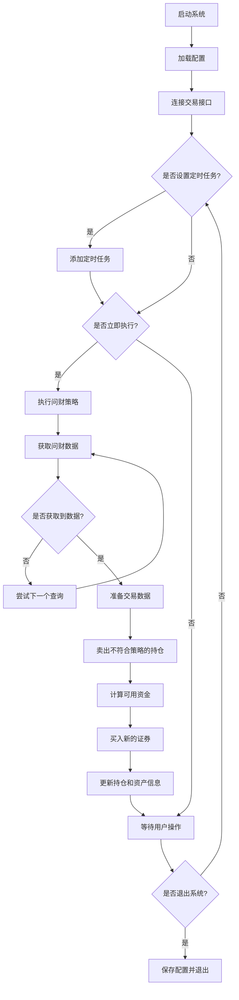

### 1. 引言

量化交易作为现代投资的重要方法，正在被越来越多的投资者所采用。本文将详细解析一个基于问财策略的量化交易系统，该系统能够自动化地将问财的选股结果转化为实际的交易指令，实现全自动化的投资流程。无论您是对量化交易感兴趣的投资者，还是希望了解Python金融应用的开发者，本文都将为您提供有价值的信息。

### 2. 系统概述

问财策略量化交易系统是一个基于Python和Tkinter开发的图形界面应用程序，它将问财的选股能力与迅投（XtQuant）的交易接口相结合，实现了从选股到交易的全自动化流程。系统的主要功能包括：

* 通过问财API获取选股结果
* 自动化执行买入和卖出操作
* 支持多种委托方式（限价、市价等）
* 灵活的价格调整功能（买入加价、卖出减价）
* 智能的资金管理和持仓调整
* 定时执行策略的能力
* 完整的持仓和资产监控
### 3. 代码结构与组织

该系统的代码结构清晰，主要包含以下几个部分：

1. 交易执行函数：place_orders、calculate_order_volume、get_stock_price等
1. 日志重定向类：LogRedirector
1. 交易回调类：MyXtQuantTraderCallback
1. 交易线程类：TraderThread
1. 图形界面类：WencaiTraderGUI
1. 主程序入口
这种结构遵循了面向对象编程的原则，将不同的功能模块化，便于维护和扩展。


### 4. 核心功能详解

### 4.1 交易执行函数

place_orders函数是系统的核心，负责将交易数据转化为实际的交易指令。它的主要逻辑包括：

1. 获取未成交订单
1. 确定交易方向（买入或卖出）
1. 撤销同方向的未成交订单
1. 遍历交易数据，执行交易操作
1. 根据委托类型和价格调整参数计算委托价格
1. 发送交易指令
这个函数的设计考虑了实际交易中的各种情况，如资金不足、持仓不足等，并进行了相应的处理。

### 4.2 交易线程

TraderThread类是系统的核心线程，负责与交易接口的交互。它实现了以下功能：

1. 初始化交易接口
1. 管理定时任务
1. 执行问财策略
1. 查询持仓和资产
1. 处理交易回调
通过将交易逻辑放在独立的线程中，系统可以在不阻塞用户界面的情况下执行交易操作，提高了用户体验。

### 4.3 策略执行逻辑

execute_wencai_strategy_with_reserved_cash方法是策略执行的核心，它的主要逻辑包括：

1. 检查当前时间是否在交易时间范围内
1. 依次尝试执行查询，直到获得有效数据
1. 获取当前持仓，准备交易数据
1. 卖出不在新策略中的持仓
1. 计算可用资金（考虑保留现金）
1. 买入新的证券或增持现有持仓
这个方法实现了完整的策略执行流程，从数据获取到交易执行，全部自动化完成。

### 4.4 图形界面

WencaiTraderGUI类实现了系统的图形界面，它使用Tkinter库创建了一个包含多个标签页的界面：

1. 系统设置：配置QMT路径和账号
1. 策略管理：设置查询条件、执行时间和交易参数
1. 持仓查询：查看当前持仓和资产情况
1. 运行日志：显示系统运行日志
界面设计简洁直观，即使是非专业用户也能轻松上手。

### 5. 关键算法与数据结构

### 5.1 查询优先级算法

系统实现了一个简单但有效的查询优先级算法：依次尝试每个查询，直到获得有效数据。这种设计允许用户设置多个备选查询条件，系统会按照顺序尝试执行，直到找到有结果的查询。

```python
# 依次尝试每个查询，直到获得有效数据
codes = None
executed_query = None
for query_info in queries:
    query = query_info['query']
    query_type = query_info['type']
    
    self.log_message(f"尝试执行查询: {query}, 类型: {query_type}")
    try:
        data = pywencai.get(query=query, query_type=query_type, loop=True)
        if data is not None and not data.empty:
            # 提取第一列数据（证券代码）
            codes = data.iloc[:, 0].tolist()
            if codes and len(codes) > 0:
                executed_query = query
                break
    except Exception as e:
        self.log_message(f"获取问财数据时发生错误: {e}")
```

### 5.2 资金分配算法

系统实现了一个简单的资金分配算法：将可用资金平均分配给需要买入的证券。这种方法简单直观，适合大多数投资场景。

```python
# 如果有新证券需要买入，现金平均分配给新买入的证券
cash_per_security = available_cash / len(buy_codes)
```

### 5.3 委托数量计算

系统根据证券类型（股票或可转债）计算委托数量，确保符合交易规则：

```python
def calculate_order_volume(price, allocated_cash, security_code):
    """
    计算委托数量，使用向下取整
    :param price: 证券价格
    :param allocated_cash: 分配的资金
    :param security_code: 证券代码
    :return: 委托数量
    """
    raw_volume = allocated_cash / price
    if security_code.startswith(('11', '12')):  # 转债
        return math.floor(raw_volume / 10) * 10  # 使用向下取整
    else:  # 股票和基金
        return math.floor(raw_volume / 100) * 100  # 使用向下取整
```


### 6. 使用的编程语言和库

该系统主要使用Python语言开发，涉及的主要库包括：

1. Tkinter：Python标准GUI库，用于创建图形界面
1. pywencai：问财API的Python封装，用于获取选股结果
1. XtQuant：迅投的Python API，用于执行交易操作
1. pandas：数据分析库，用于处理选股结果
1. schedule：任务调度库，用于实现定时执行
1. threading：线程库，用于实现多线程
1. datetime：日期时间库，用于处理时间相关操作
1. json：JSON处理库，用于配置文件的读写
这些库的组合使用，使得系统能够实现从数据获取到交易执行的全流程自动化。

### 7. 系统流程图



### 8. 潜在限制和改进建议

尽管该系统功能完善，但仍存在一些潜在的限制和可改进之处：

### 8.1 限制

1. 错误处理：虽然系统包含了基本的错误处理，但对于某些特殊情况（如网络中断、API变更等）的处理可能不够完善。
1. 风险控制：系统缺乏完善的风险控制机制，如止损、止盈等。
1. 性能问题：在处理大量数据或高频交易时，可能存在性能瓶颈。
1. 依赖问题：系统依赖于问财API和迅投API，如果这些API发生变化，可能需要相应的调整。
### 8.2 改进建议

1. 增强风险控制：添加止损、止盈、仓位控制等风险管理功能。
1. 优化资金分配算法：实现更复杂的资金分配算法，如基于市值、波动率等因素的加权分配。
1. 增加回测功能：添加策略回测功能，帮助用户评估策略的历史表现。
1. 增强数据分析：添加更多的数据分析功能，如技术指标计算、图表展示等。
1. 优化用户界面：改进用户界面，提供更直观的操作体验。
1. 增加多账户支持：支持多个交易账户的管理和操作。
### 9. 结论

问财策略量化交易系统是一个功能完善的自动化交易工具，它将问财的选股能力与迅投的交易接口相结合，实现了从选股到交易的全自动化流程。系统设计合理，代码结构清晰，功能实用，适合有一定投资经验的用户使用。

通过本文的解析，我们深入了解了系统的设计思路、代码结构、核心功能和实现细节。希望这些信息能够帮助读者更好地理解量化交易系统的工作原理，为自己的投资或开发工作提供参考。

量化交易是一个不断发展的领域，随着技术的进步和市场的变化，交易系统也需要不断更新和完善。希望本文能为读者提供一个良好的起点，开启量化交易的探索之旅。

