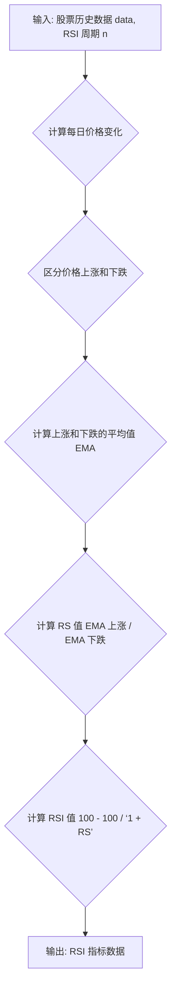

## 用途说明

该函数用于计算股票的相对强弱指数 (RSI)，这是一个衡量股票价格变动强度和速度的技术指标。

## 参数

* data (pd.DataFrame): 包含股票历史数据的 Pandas DataFrame，必须包含 'close' 列，表示每日收盘价。
* n (int): 计算 RSI 的周期数，默认为 14。
## 返回值

* pd.Series: 包含计算出的 RSI 值的 Pandas Series，索引与输入数据的索引相同。
## 用法

调用 RSI(data, n) 函数，传入股票历史数据和 RSI 计算周期，即可获得 RSI 指标数据。

## 示例

```python
import pandas as pd
import yuhanbolh as lh


# 计算 14 日 RSI
rsi_14 = lh.RSI(data, 14)

# 打印结果
print(rsi_14)
```

## 流程图



## 代码

```python
# 计算RSI指标，参数有2，一个为数据源，另一个为日期，一般为14，即RSI(data, 14)
def RSI(data, n):
    lc = data['close'].shift(1)
    diff = data['close'] - lc
    up = diff.where(diff > 0, 0)
    down = -diff.where(diff < 0, 0)
    ema_up = up.ewm(alpha=1/n, adjust=False).mean()
    ema_down = down.ewm(alpha=1/n, adjust=False).mean()
    rs = ema_up / ema_down
    rsi = 100 - 100 / (1 + rs)
    return pd.Series(rsi, index=data.index, name='RSI_' + str(n)).dropna()
```

