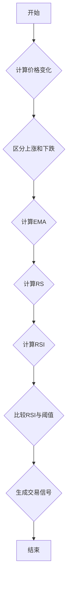

## 用途说明

根据RSI指标计算买卖信号。

## 参数

* data (DataFrame): 包含交易数据的DataFrame，必须包含'close'列。
* n (int): RSI计算的周期长度。
## 返回值

DataFrame: 包含RSI信号的DataFrame，列名为'RSI_' + str(n)，其中1表示买入信号，-1表示卖出信号，0表示无信号。

## 用法

```python
import pandas as pd
import numpy as np

# 假设data是一个包含'close'列的DataFrame
# 例如:
# data = pd.DataFrame({'close': [10, 11, 12, 11, 10, 11, 12, 13, 14, 13]})

# 调用RSI_zb函数计算RSI信号
rsi_signal = RSI_zb(data, 14)

# 打印RSI信号
print(rsi_signal)
```

## 示例

```python
import pandas as pd
import numpy as np

# 创建示例数据
data = pd.DataFrame({'close': [10, 11, 12, 11, 10, 11, 12, 13, 14, 13, 12, 11, 10, 9, 10]})

# 计算RSI(14)信号
rsi_signal = RSI_zb(data, 14)

# 将信号添加到原始数据中
data['RSI_14'] = rsi_signal

# 打印包含RSI信号的数据
print(data)
```

## 流程图



## 函数代码

```python
import numpy as np
import pandas as pd

def RSI_zb(data, n):
    lc = data['close'].shift(1)
    diff = data['close'] - lc
    up = diff.where(diff > 0, 0)
    down = -diff.where(diff < 0, 0)
    ema_up = up.ewm(alpha=1/n, adjust=False).mean()
    ema_down = down.ewm(alpha=1/n, adjust=False).mean()
    rs = ema_up / ema_down
    rsi = 100 - 100 / (1 + rs)

    rsi_prev = rsi.shift(1)  # 前一个周期的RSI
    buy_signal = (rsi < 30) & (rsi > rsi_prev)
    sell_signal = (rsi > 70) & (rsi < rsi_prev)
    signal = np.where(buy_signal, 1, np.where(sell_signal, -1, 0))
    
    return pd.DataFrame({'RSI_' + str(n): signal})
```

