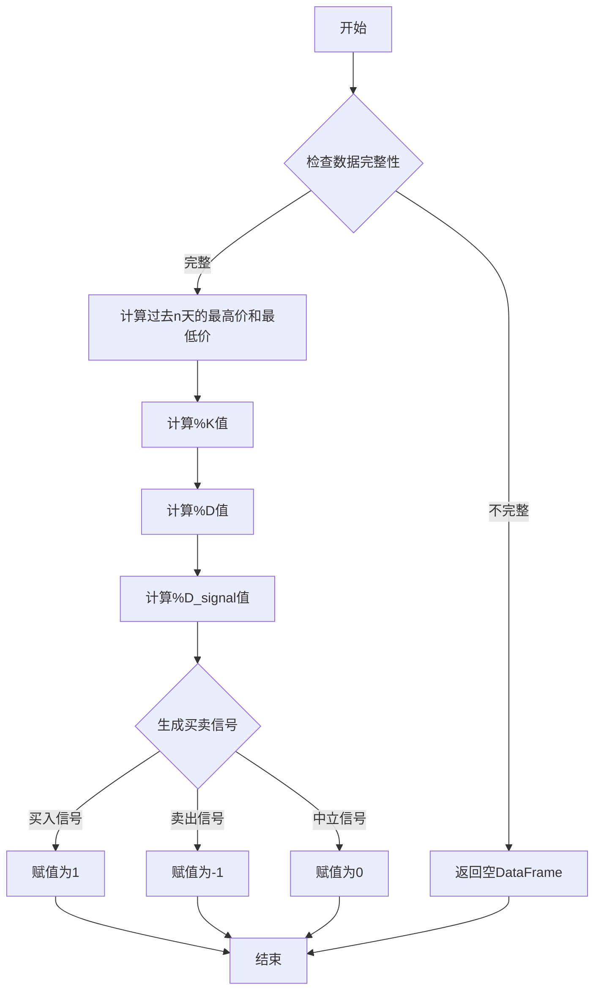

## 用途说明

根据Stochastic指标生成交易信号，包括买入、卖出和中立信号。

## 参数

* data (DataFrame): 包含股票或金融资产历史数据的DataFrame，必须包含'high'、'low'和'close'列。
* n (int): 计算Stochastic指标的周期长度，用于确定最高价和最低价的范围。
* m (int): 计算%D值的滚动平均周期。
* t (int): 计算%D_signal值的滚动平均周期。
## 用法

函数调用示例及返回值说明。

## 示例

```python
import pandas as pd

# 假设df是一个包含'high'、'low'和'close'列的DataFrame
# df = pd.DataFrame({'high': [..., ...], 'low': [..., ...], 'close': [..., ...]})

signal_df = STOK_zb(df, 14, 3, 3)
print(signal_df.head())
```

返回值是一个DataFrame，包含名为'STOK_14'的列，其中：

* 1表示买入信号。
* -1表示卖出信号。
* 0表示中立信号。
## 函数工作流程图



## 函数代码

```python
import numpy as np
import pandas as pd

def STOK_zb(data, n, m, t):
    # 计算过去n天的最高价
    high = data['high'].rolling(n).max()
    # 计算过去n天的最低价
    low = data['low'].rolling(n).min()
    # 计算%K值
    k = 100 * (data['close'] - low) / (high - low)
    # 使用m天的滚动平均计算%D值
    d = k.rolling(m).mean()
    # 使用t天的滚动平均计算%D_signal值
    d_signal = d.rolling(t).mean()

    main_line = d
    signal_line = d_signal
    main_line_prev = d.shift(1)
    signal_line_prev = d_signal.shift(1)

    buy_signal = (main_line < 20) & (main_line_prev < signal_line_prev) & (main_line > signal_line)
    sell_signal = (main_line > 80) & (main_line_prev > signal_line_prev) & (main_line < signal_line)
    signal = np.where(buy_signal, 1, np.where(sell_signal, -1, 0))
    
    return pd.DataFrame({'STOK_' + str(n): signal})
```

