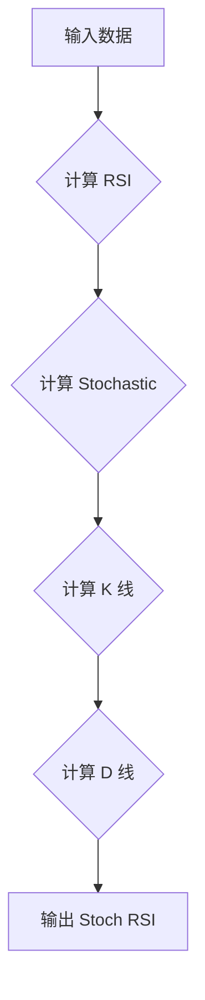

## 用途说明

该函数用于计算金融时间序列数据的随机相对强弱指标 (Stochastic RSI)。Stoch RSI 是一个动量震荡指标，它将 RSI 的值标准化到 0 到 100 的范围内。它比传统的 RSI 更敏感，可以帮助交易者识别超买和超卖情况。

## 参数

* data (pd.DataFrame): 包含金融数据的 Pandas DataFrame，必须包含 'close' 列，表示收盘价。
* smoothK (int): Stoch RSI 中 %K 线的平滑因子，默认值为 3。
* smoothD (int): Stoch RSI 中 %D 线的平滑因子，默认值为 3。
* lengthRSI (int): 计算 RSI 时使用的周期数，默认值为 14。
* lengthStoch (int): 计算 Stoch RSI 时使用的周期数，默认值为 14。
## 返回值

* pd.DataFrame: 包含两列的 Pandas DataFrame：
## 用法

通过将金融数据 DataFrame 和所需的参数传递给函数来调用函数，例如：

```python
import pandas as pd
import yuhanbolh as lh


# 计算 Stoch RSI
stoch_rsi = Stoch_RSI(data, 3, 3, 14, 14)

# 打印结果
print(stoch_rsi)
```

## 流程图



## 代码

```python
import pandas as pd

# 计算Stoch_RSI(data,3, 3, 14, 14)，有5个参数，第1个为数据源
def Stoch_RSI(data, smoothK, smoothD, lengthRSI, lengthStoch):
    # 计算RSI
    lc = data['close'].shift(1)
    diff = data['close'] - lc
    up = diff.where(diff > 0, 0)
    down = -diff.where(diff < 0, 0)
    ema_up = up.ewm(alpha=1/lengthRSI, adjust=False).mean()
    ema_down = down.ewm(alpha=1/lengthRSI, adjust=False).mean()
    rs = ema_up / ema_down
    rsi = 100 - 100 / (1 + rs)
    # 计算Stochastic
    stoch = (rsi - rsi.rolling(window=lengthStoch).min()) / (rsi.rolling(window=lengthStoch).max() - rsi.rolling(window=lengthStoch).min())
    k = stoch.rolling(window=smoothK).mean() * 100
    d = k.rolling(window=smoothD).mean()
    
    # 创建一个新的DataFrame来存储结果
    result = pd.DataFrame({
        'Stoch_RSI_K': k,
        'Stoch_RSI_D': d
    }, index=data.index)  # 使用原始数据的索引
    
    return result.dropna()
```

