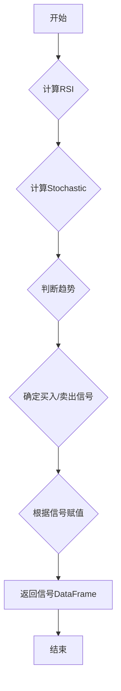

## 用途说明

根据Stoch_RSI指标生成买卖信号。

## 参数

* data (DataFrame): 包含OHLC（开盘价、最高价、最低价、收盘价）数据的DataFrame。
* smoothK (int): K线平滑周期，默认为3。
* smoothD (int): D线平滑周期，默认为3。
* lengthRSI (int): RSI计算周期，默认为14。
* lengthStoch (int): Stochastic计算周期，默认为14。
## 返回值

* DataFrame: 包含Stoch_RSI信号的DataFrame，其中1表示买入信号，-1表示卖出信号，0表示中立信号。
## 用法

使用包含时间序列数据的DataFrame调用Stoch_RSI_zb函数，获取买卖信号。

## 示例

```python
import pandas as pd
import numpy as np

# 假设data是一个包含'close'列的DataFrame
data = pd.DataFrame({'close': np.random.rand(100)})
signals = Stoch_RSI_zb(data, 3, 3, 14, 14)
print(signals.head())
```

## 函数流程图



## 函数代码

```python
def Stoch_RSI_zb(data, smoothK=3, smoothD=3, lengthRSI=14, lengthStoch=14):
    # 计算RSI
    lc = data['close'].shift(1)
    diff = data['close'] - lc
    up = diff.where(diff > 0, 0)
    down = -diff.where(diff < 0, 0)
    ema_up = up.ewm(alpha=1/lengthRSI, adjust=False).mean()
    ema_down = down.ewm(alpha=1/lengthRSI, adjust=False).mean()
    rs = ema_up / ema_down
    rsi = 100 - 100 / (1 + rs)
    
    # 计算Stochastic
    stoch = (rsi - rsi.rolling(window=lengthStoch).min()) / (rsi.rolling(window=lengthStoch).max() - rsi.rolling(window=lengthStoch).min())
    k = stoch.rolling(window=smoothK).mean()*100
    d = k.rolling(window=smoothD).mean()
    
    # 判断趋势：1为上升，-1为下降
    trend = (data['close'] > data['close'].rolling(window=10).mean()).astype(int)
    trend[trend == 0] = -1
    
    # 根据Stochastic RSI的K线和D线确定买入、卖出信号
    buy_signal = (trend == -1) & (k < 20) & (d < 20) & (k > d) & (k.shift(1) <= d.shift(1))
    sell_signal = (trend == 1) & (k > 80) & (d > 80) & (k < d) & (k.shift(1) >= d.shift(1))
    
    # 根据信号赋值：1为买入，-1为卖出，0为中立
    signal = np.where(buy_signal, 1, np.where(sell_signal, -1, 0))
    
    return pd.DataFrame({'Stoch_RSI': signal})
```

