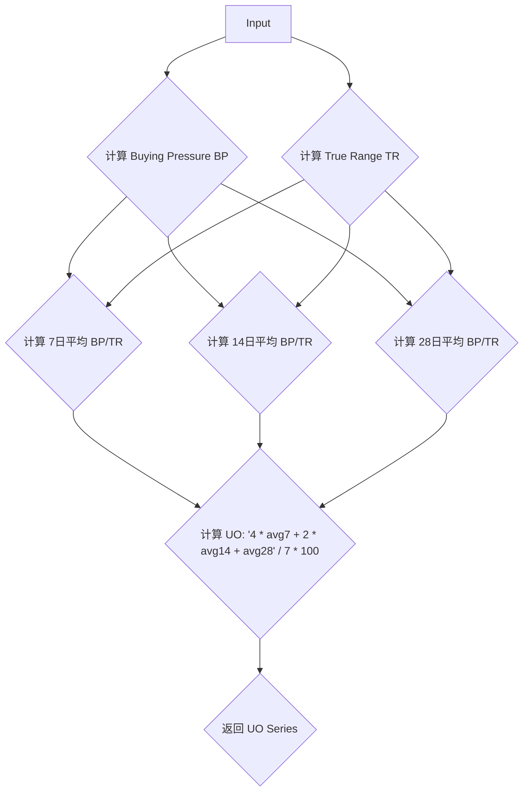

### 用途说明

该函数用于计算金融市场技术分析中的终极震荡指标 (Ultimate Oscillator)。终极震荡指标是一个动量指标，通过衡量价格相对于特定时间段内的价格范围来识别超买和超卖情况。

### 参数

* data (pd.DataFrame): 包含金融市场数据的 Pandas DataFrame，至少包含 'high'、'low' 和 'close' 列，分别代表最高价、最低价和收盘价。
* n1 (int): 计算短期平均值的周期，通常为 7。
* n2 (int): 计算中期平均值的周期，通常为 14。
* n3 (int): 计算长期平均值的周期，通常为 28。
### 返回值

* (pd.Series): 返回一个 Pandas Series，包含计算出的终极震荡指标 (UO) 值，索引与输入数据相同。
### 用法

通过将包含金融市场数据的 DataFrame 和三个周期参数传递给 UO 函数来计算终极震荡指标。函数将返回一个包含 UO 值的 Series。

### 示例

```python
import pandas as pd

# 计算终极震荡指标
uo = lh.UO(data, 7, 14, 28)

# 打印结果
print(uo)
```

### 流程图



## 代码

```python
# 计算Ultimate Oscillator终极震荡指标UO (data,7, 14, 28)，有4个参数，第1个是数据源，其他的是日期
def UO(data, n1, n2, n3):
    min_low_or_close = pd.concat([data['low'], data['close'].shift(1)], axis=1).min(axis=1)
    max_high_or_close = pd.concat([data['high'], data['close'].shift(1)], axis=1).max(axis=1)
    bp = data['close'] - min_low_or_close
    tr_ = max_high_or_close - min_low_or_close
    avg7 = bp.rolling(n1).sum() / tr_.rolling(n1).sum()
    avg14 = bp.rolling(n2).sum() / tr_.rolling(n2).sum()
    avg28 = bp.rolling(n3).sum() / tr_.rolling(n3).sum()
    UO = 100 * ((4 * avg7) + (2 * avg14) + avg28) / 7
    return pd.Series(UO, index=data.index, name='UO').dropna()
```

