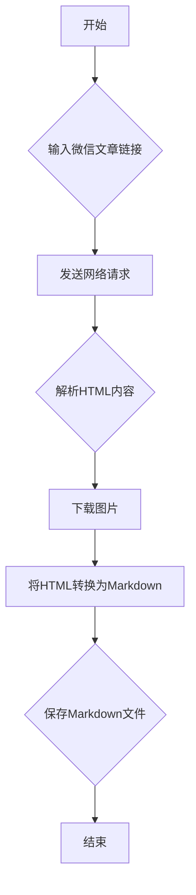

### 用途说明

根据微信文章链接下载为本地Markdown文件，并将文章中的图片下载到指定目录。

### 参数

* img_path (str, optional): 图片保存路径，默认为 "D:\wenjian\obsidian\RSS图片"。如果路径不存在，则自动创建。
### 用法

创建一个 Url2Md 对象，并调用其 run 方法，传入微信文章链接即可下载。

### 示例

```python
from url2md import Url2Md

downloader = Url2Md()
title = downloader.run("https://mp.weixin.qq.com/s/your-article-url")

print(f"文章 '{title}' 下载完成！")
```

### 流程图



## 代码

```python
# 下载公众号文章
class Url2Md(object):
    """根据微信文章链接下载为本地Markdown文件"""

    def __init__(self, img_path="D:\\wenjian\\obsidian\\RSS图片"):
        self.img_path = img_path
        if not os.path.exists(self.img_path):
            os.makedirs(self.img_path)
        self.data_src_re = re.compile(r'data-src="(.*?)"')
        self.data_croporisrc_re = re.compile(r'data-croporisrc="(.*?)"')
        self.src_re = re.compile(r'src="(.*?)"')

    @staticmethod
    def replace_name(title):
        rstr = r"[\/\\\:\*\?\"\<\>\|]"  # '/ \ : * ? " < > |'
        title = re.sub(rstr, "", title).replace("|", "").replace("\n", "")
        return title

    def download_img(self, url):
        # 根据链接提取图片名
        name = "{}.{}".format(url.split("/")[-2], url.split("/")[3].split("_")[-1])
        save_path = os.path.join(self.img_path, name)
        # 如果该图片已被下载，可以无需再下载，直接返回绝对路径即可
        if os.path.isfile(save_path):
            return os.path.abspath(save_path)
    
        response = requests.get(url)
        img = response.content
        with open(save_path, "wb") as f:
            f.write(img)
        return os.path.abspath(save_path)

    def html_to_md(self, html):
        soup = bs(html, "html.parser")

        # 处理图片链接，替换为绝对路径
        for img in soup.find_all('img'):
            img_url = img.get('data-src') or img.get('src')
            if img_url:
                local_img_path = self.download_img(img_url)
                img['src'] = local_img_path
                del img['data-src']  # 删除data-src属性，如果存在的话

        # 使用html2text转换器
        h = html2text.HTML2Text()
        h.ignore_links = False
        text = h.handle(str(soup))  # 需要将soup对象转换回字符串

        return text

    @staticmethod
    def get_title(html):
        soup = bs(html, "html.parser")
        title_tag = soup.find('h1') or soup.find('h2')
        if title_tag:
            return title_tag.get_text().strip()
        return "Untitled"
    
    def run(self, url):
        try:
            response = requests.get(url)
            html = response.content.decode('utf-8')
            soup = bs(html, 'html.parser')

            # 尝试从文章内容中提取标题
            title = self.get_title(html)
            title = self.replace_name(title)

            md_text = self.html_to_md(html)

            # Remove everything above two underscores (inclusive)
            md_text = re.sub(r'.*____\n', '', md_text, count=1, flags=re.DOTALL)

            # Remove everything after and including "预览时标签不可点"
            md_text = re.sub(r'预览时标签不可点.*', '', md_text, flags=re.DOTALL)

            # 保存Markdown文件
            md_filename = fr"D:\wenjian\obsidian\笔记\归纳检索\RSS订阅\{title}.md"
            with open(md_filename, "w", encoding="utf-8") as f:
                f.write(md_text)

            return title
        except Exception as e:
            return f"处理URL {url} 时发生错误: {e}"
```

