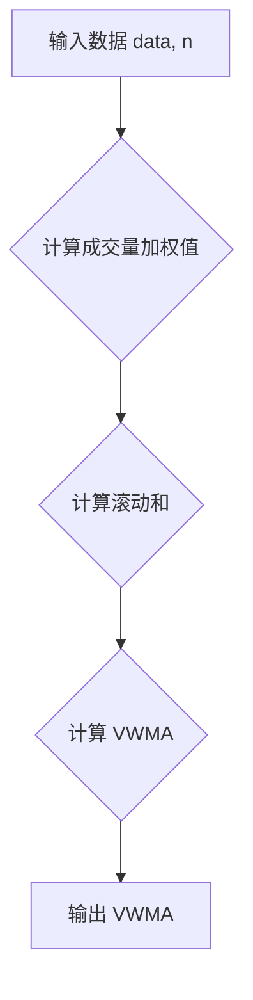

## 用途说明

该函数用于计算给定数据序列的成交量加权移动平均线 (VWMA)。VWMA 是一种特殊的移动平均线，它考虑了成交量对价格的影响，成交量越大，对平均值的影响越大。

## 参数

* data (pd.DataFrame): 包含金融数据的 Pandas DataFrame，必须包含 'close'（收盘价） 和 'volume'（成交量） 列。
* n (int): VWMA 的周期数，例如，n=20 表示计算 20 日 VWMA。
## 返回值

* pd.Series: 包含 VWMA 值的 Pandas Series，命名为 'VWMA_' + str(n)。
## 用法

调用 VWMA(data, n) 函数，传入包含 'close' 和 'volume' 列的 Pandas DataFrame 以及 VWMA 的周期数，即可计算出相应的 VWMA 值。

## 示例

```python
import pandas as pd
import yuhanbolh as lh


# 计算 5 日 VWMA
vwma_5 = VWMA(data, 5)

# 打印结果
print(vwma_5)
```

## 函数工作流程图



## 代码

```python
# 成交量加权移动平均线 VWMA (data, 20)，参数有2个，1个是数据源，另一个是日期，通过为20
def VWMA(data, n):
    VWMA = pd.Series((data['close'] * data['volume']).rolling(n).sum() / data['volume'].rolling(n).sum(), name='VWMA_' + str(n))
    return VWMA.dropna()
```

