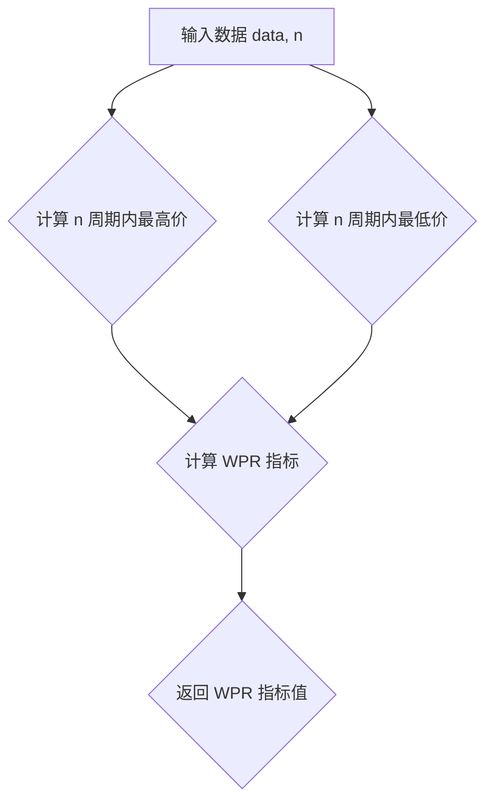

## 用途说明

该函数用于计算金融市场技术指标中的威廉指标（Williams %R，简称 WPR）。

## 参数

* data (pd.DataFrame): 包含股票或其他金融资产价格数据的 Pandas DataFrame，必须包含 'high'、'low' 和 'close' 列。
* n (int): 计算 WPR 指标的时间周期，默认为 14。
## 用法

函数调用示例：

```python
import yuhanbolh as lh

wpr_values = lh.WPR(data, n=14)
```

返回值：

* wpr_values (pd.Series): 包含计算得到的 WPR 指标值的 Pandas Series，名称为 'WPR_n'，其中 n 为时间周期。
## 示例

```python
import pandas as pd

# 示例数据
data = pd.DataFrame({
    'high': [10, 12, 13, 11, 14, 15, 13],
    'low': [8, 9, 10, 9, 11, 12, 10],
    'close': [9, 11, 12, 10, 13, 14, 12]
})

# 计算 WPR 指标
wpr = WPR(data, n=14)

# 打印结果
print(wpr)
```

## 流程图



## 代码

```python
# 计算威廉百分比变动，参数有2，第1是数据源，第二是日期，一般为14，即WPR(data, 14)
def WPR(data, n):
    WPR = pd.Series((data['high'].rolling(n).max() - data['close']) / (data['high'].rolling(n).max() - data['low'].rolling(n).min()) * -100, name='WPR_' + str(n))
    return WPR.dropna()
```

