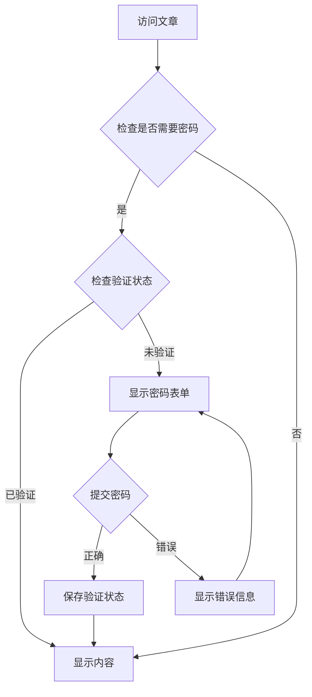

[WordPress 分类和文章密码访问 | 三人聚智-余汉波程序小店](https://jy.sanrenjz.com/buy/21)

视频：[WordPress文章密码保护插件的设计与实现_哔哩哔哩_bilibili](https://www.bilibili.com/video/BV16hXsYVEPD/?vd_source=247ac77d4ae7339ea06d0fec09aa8f70)

## 1. 项目概述

本文将深入解析一个用于WordPress的文章密码保护插件。这个插件提供了双重密码保护机制，允许管理员为整个分类或单独文章设置访问密码，实现了灵活的内容访问控制。

## 2. 技术架构

该插件主要基于PHP语言开发，深度集成WordPress插件系统，主要包含以下核心组件：

1. 初始化模块
1. 后台管理模块
1. 前端展示模块
1. 安全控制模块


## 3. 核心功能实现

### 3.1 插件初始化

插件使用WordPress标准的插件头部注释定义基本信息：

```php
/*
Plugin Name: 文章和分类密码阅读
Text Domain: access-post-password
...
*/
```

通过add_action('plugins_loaded', 'acpwd_lang_init')实现多语言支持：

```php
function acpwd_lang_init() {
    load_plugin_textdomain('access-post-password', false, basename(dirname(__FILE__)));
}
```

### 3.2 密码保护机制

插件实现了两种密码验证方式：

1. Session验证
1. Cookie验证
密码验证核心代码：

```php
function acpwd_mdp_check() {
    if(isset($_POST['acpwd-pass']) && isset($_POST['post-id'])) {
        $post_id = intval($_POST['post-id']);
        $user_password = $_POST['acpwd-pass'];
        
        // 验证密码
        if($is_password_correct) {
            if($protectway == 'session') {
                $_SESSION['acpwd_validated_posts'][$post_id] = true;
            } else {
                setcookie('acpwd_cookie_post_'.$post_id, 1, time() + $cookieexp, '/');
            }
        }
    }
}
```

### 3.3 内容过滤处理

使用WordPress的内容过滤机制，对受保护内容进行处理：

```php
add_filter('the_content', 'acpwd_frontend_changes', 2);
add_filter('the_excerpt', 'acpwd_frontend_changes', 3);
```

### 3.4 密码管理

实现了两级密码保护：

1. 分类级别密码
1. 文章级别密码（优先级更高）
密码存储采用crypt加密：

```php
$category_passwords[$cat_id] = crypt($password, $password);
```

## 4. 数据流程



## 5. 安全性考虑

1. 密码存储安全
1. 验证机制安全
1. 数据传输安全
### 6. 性能优化

1. 代码优化
1. 资源加载优化
### 7. 潜在改进建议

1. 功能增强
1. 安全性提升
1. 用户体验优化
## 8. 总结

这个WordPress插件通过巧妙的设计实现了灵活的内容访问控制。它不仅提供了双重密码保护机制，还考虑到了安全性、性能和用户体验等多个方面。通过合理使用WordPress提供的钩子系统和数据库操作，确保了插件的可靠性和可维护性。

虽然还有一些可以改进的空间，但整体而言，这是一个设计良好的WordPress插件，能够满足大多数内容保护需求。对于想要学习WordPress插件开发的开发者来说，这也是一个很好的参考案例。

