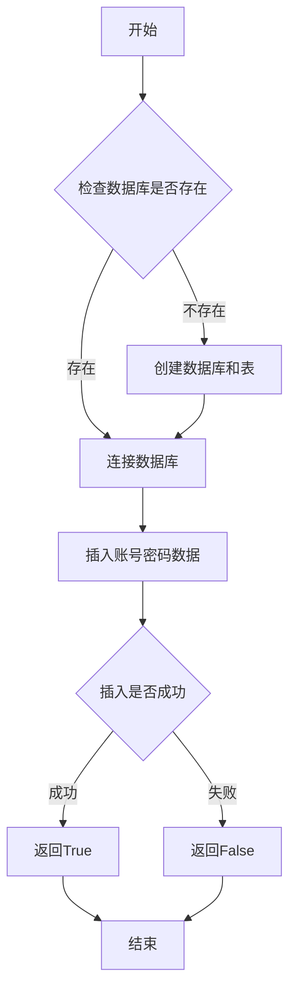

## 用途说明

向 SQLite 数据库中添加项目相关的账号密码信息。该函数会自动检查数据库是否存在，如果不存在则创建数据库和必要的表结构。

## 参数

* project_name (str): 项目名称，用于标识不同的项目
* username (str): 用户名
* password (str): 密码
## 返回值

* bool: 添加成功返回 True，失败返回 False
## 用法

函数调用示例及返回值说明：

```python
# 添加新项目的账号密码
success = add_account("项目名称", "用户名", "密码")
if success:
    print("账号添加成功")
else:
    print("账号添加失败")
```

## 示例

```python
# 示例1：添加测试项目账号
add_account("TEST_PROJECT", "test_user", "test_password")

# 示例2：添加实际项目账号
add_account("生产环境", "admin", "secure_password")
```

## 工作流程



## 注意事项

1. 数据库文件默认保存在 D:\data\database\mm.db
1. 表名固定为 connect_account_password
1. 每个项目可以添加多条账号密码记录
1. 函数会自动处理数据库和表的创建
## 错误处理

函数会捕获并打印以下可能的错误：

* 数据库创建失败
* 数据插入失败
* 数据库连接错误
## 代码

```python
import sqlite3
import os

# 创建账号密码数据库及表
def create_account_database(db_path):
    try:
        # 确保目录存在
        os.makedirs(os.path.dirname(db_path), exist_ok=True)
        
        # 创建数据库连接
        conn = sqlite3.connect(db_path)
        cursor = conn.cursor()
        
        # 创建表
        cursor.execute('''
        CREATE TABLE IF NOT EXISTS connect_account_password (
            id INTEGER PRIMARY KEY AUTOINCREMENT,
            project_name TEXT NOT NULL,
            username TEXT,
            password TEXT
        )
        ''')
        
        # 提交更改并关闭连接
        conn.commit()
        conn.close()
        
        print(f"已成功创建数据库 {db_path} 和表 connect_account_password")
    except Exception as e:
        print(f"创建数据库时出错：{e}")


# 向数据库添加账号密码，参数为项目名称，用户名，密码
def add_account(project_name, username, password):
    db_path = r"D:\data\database\mm.db"
    try:
        # 如果数据库不存在，先创建数据库
        if not os.path.exists(db_path):
            create_account_database(db_path)
            
        conn = sqlite3.connect(db_path)
        cursor = conn.cursor()

        # 插入数据
        cursor.execute('''
        INSERT INTO connect_account_password (project_name, username, password)
        VALUES (?, ?, ?)
        ''', (project_name, username, password))
        
        # 提交更改并关闭连接
        conn.commit()
        cursor.close()
        conn.close()
        
        print(f"已成功添加项目 {project_name} 的账号信息")
        return True
    except Exception as e:
        print(f"添加账号信息时出错：{e}")
        return False

if __name__ == "__main__":

    # 测试添加功能
    add_account("TEST_PROJECT", "test_user", "test_password")

```

