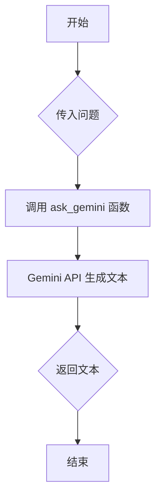

## 用途说明

调用 Gemini API 生成文本，可配置模型参数和安全策略。

## 参数

* question (str): 要发送给 Gemini API 的问题。
## 用法

调用 ask_gemini(question) 并传入问题，函数将返回 Gemini API 生成的文本。

## 示例

```python
response = ask_gemini("你好，请问今天天气怎么样？")
print(f"Gemini API 的回复：{response}")
```

## 流程图



## 代码

```python
def ask_gemini(question):
    # 代理设置，按需配置
    # os.environ['HTTP_PROXY'] = 'http://127.0.0.1:7890'
    # os.environ['HTTPS_PROXY'] = 'http://127.0.0.1:7890'

    # 配置API密钥
    genai.configure(api_key=check_account("password", "GOOGLE_API_KEY"))

    # 设置模型参数
    generation_config = {
        "temperature": 0.5,
        "top_p": 0.95,
        "top_k": 0,
        "max_output_tokens": 8192,
    }

    # 设置内容安全策略
    safety_settings = [
        {
            "category": "HARM_CATEGORY_HARASSMENT",
            "threshold": "BLOCK_MEDIUM_AND_ABOVE"
        },
        {
            "category": "HARM_CATEGORY_HATE_SPEECH",
            "threshold": "BLOCK_MEDIUM_AND_ABOVE"
        },
        {
            "category": "HARM_CATEGORY_SEXUALLY_EXPLICIT",
            "threshold": "BLOCK_MEDIUM_AND_ABOVE"
        },
        {
            "category": "HARM_CATEGORY_DANGEROUS_CONTENT",
            "threshold": "BLOCK_MEDIUM_AND_ABOVE"
        },
    ]

    # 创建模型实例
    model = genai.GenerativeModel(model_name="gemini-1.5-pro-latest",
                                  generation_config=generation_config,
                                  safety_settings=safety_settings)
    
    # 创建聊天会话
    convo = model.start_chat(history=[])
    
    # 发送传入的问题并获取响应
    convo.send_message(question)
    return convo.last.text
```

