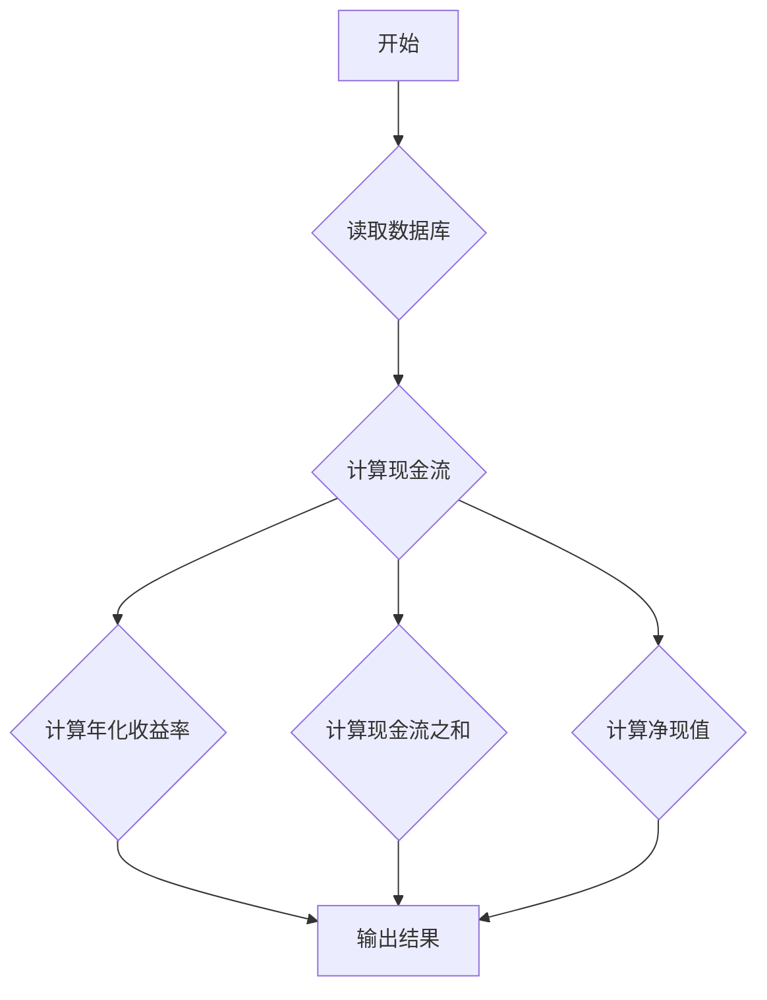

## 用途说明

本函数用于计算投资组合的年化收益率、现金流之和和净现值，数据源来自指定的SQLite数据库表格。

## 参数

* table_name (str): 数据库中存储交易记录的表格名称，不包含"_hedge"后缀。
## 用法

函数调用示例及返回值说明：

```python
import yuhanbolh as lh
result = lh.calculate_annual_return("交易记录表")
print(result)
```

返回值 result 是一个 Pandas DataFrame，包含以下列：

* 年化收益率:  基于内部收益率 (XIRR) 计算的年化收益率。
* 现金流之和: 投资组合所有现金流的总和。
* 净现值:  使用预设折现率（5%）计算的投资组合净现值。
## 示例

```python
# 假设数据库中有一个名为 "stock_transactions" 的表格，记录了股票交易记录。
result = calculate_annual_return("stock_transactions")
print(result)
```

## 流程图



## 代码

```python
# 计算年化收益率、现金流之和和净现值
def calculate_annual_return(table_name):
    db_path = r"D:\wenjian\python\smart\data\guojin_account.db"
    conn = sqlite3.connect(db_path)

    # 使用增加了"_hedge"后缀的表名
    table_name_hedge = f"{table_name}_hedge"
    query = f"SELECT 成交时间, 成交金额, 买卖 FROM {table_name_hedge}"
    data = pd.read_sql_query(query, conn)

    conn.close()

    # 将成交时间转换为日期格式
    data['成交时间'] = pd.to_datetime(data['成交时间'])

    # 计算现金流
    data['现金流'] = -data['成交金额'] * data['买卖']

    # 计算年化收益率
    annual_return = calculate_xirr(data['现金流'].values, data['成交时间'].values)

    # 计算“现金流”的和
    cash_flows_sum = data['现金流'].sum()

    # 计算净现值
    discount_rate = 0.1  # 折现率设为5%
    periods = (data['成交时间'] - data['成交时间'].min()).dt.days / 365.25  # 计算每笔现金流的时间（以年为单位）
    npv = sum(data['现金流'] / (1 + discount_rate) ** periods)

    # 创建一个新的DataFrame来返回结果
    result = pd.DataFrame({
        '年化收益率': [annual_return],
        '现金流之和': [cash_flows_sum],
        '净现值': [npv]
    })

    return result
```

