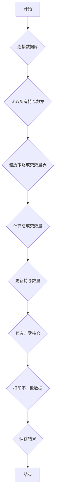

### 用途说明

该函数用于计算除指定策略交易以外的剩余持仓，并将结果保存到名为 "other_positions" 的数据表中。

### 参数

* db_path (str): SQLite 数据库文件的路径。
* strategy_tables (list): 包含策略成交数量表名的列表。
### 用法

该函数连接到指定的 SQLite 数据库，并执行以下操作：

1. 从 account_holdings 表中读取所有持仓数据。
1. 遍历 strategy_tables 中的每个策略成交数量表：
1. 筛选持仓数量不为零的记录。
1. 打印持仓数量与可用数量不一致的数据。
1. 将结果保存到名为 "other_positions" 的数据表中，如果该表已存在则覆盖。
### 示例

```python
import yuhanbolh as lh

# 数据库文件路径
db_path = 'my_database.db'

# 策略成交数量表名列表
strategy_tables = ['strategy_a_trades', 'strategy_b_trades']

# 调用函数计算策略外持仓
lh.calculate_remaining_holdings(db_path, strategy_tables)
```

### 流程图



