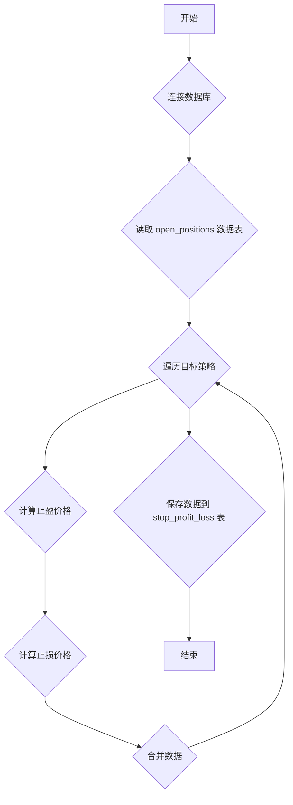

### 用途说明

该函数用于计算指定策略的止盈和止损价格，并将结果保存到数据库中的 stop_profit_loss 表。

### 参数

* target_strategies (list):  目标策略名称列表。
* profit_multipliers (list):  止盈倍数列表，与目标策略一一对应。
* loss_multipliers (list): 止损倍数列表，与目标策略一一对应。
### 用法

函数调用 calculate_stop_profit_loss(target_strategies, profit_multipliers, loss_multipliers)，无需返回值。

### 示例

```python
import yuhanbolh as lh

target_strategies = ['策略A', '策略B']
profit_multipliers = [1.1, 1.2]  # 策略A止盈10%，策略B止盈20%
loss_multipliers = [0.95, 0.9]  # 策略A止损5%，策略B止损10%

lh.calculate_stop_profit_loss(target_strategies, profit_multipliers, loss_multipliers)
```

### 流程图



