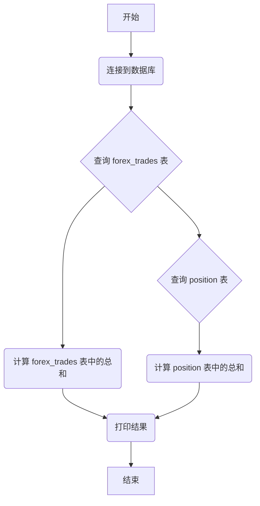

## 用途说明

该函数用于从SQLite数据库中检索指定EA_id和magic的交易数据，并计算交易佣金、隔夜利息和利润的总和。

## 参数

* db_path (str): SQLite数据库文件的路径。
* ea_id (int): 要筛选的EA_id。
* magic (int): 要筛选的magic值。
## 用法

函数调用 calculate_totals(db_path, ea_id, magic) 将打印以下内容：

* 交易佣金总和
* forex_trades 表中隔夜利息总和
* forex_trades 表中利润总和
* position 表中隔夜利息总和
* position 表中利润总和
* 所有列的总和
## 示例

```python
import yuhanbolh as lh
lh.calculate_totals(r"D:\wenjian\python\smart\data\mt5_demo.db", 9, 9)
```

## 流程图



```python
import sqlite3

def calculate_totals(db_path, ea_id, magic):
    # 连接到SQLite数据库
    conn = sqlite3.connect(db_path)
    cursor = conn.cursor()

    # 执行SQL查询，筛选出EA_id为指定值的所有数据
    cursor.execute("""
    SELECT "交易佣金", "隔夜利息", "利润"
    FROM forex_trades
    WHERE "EA_id" = ?
    """, (ea_id,))

    # 获取查询结果
    results_forex_trades = cursor.fetchall()

    # 初始化总和变量
    total_commission = 0.0
    total_swap_forex_trades = 0.0
    total_profit_forex_trades = 0.0

    # 计算总和
    for row in results_forex_trades:
        total_commission += row[0]
        total_swap_forex_trades += row[1]
        total_profit_forex_trades += row[2]

    # 执行SQL查询，筛选出magic为指定值的所有数据
    cursor.execute("""
    SELECT "swap", "profit"
    FROM position
    WHERE "magic" = ?
    """, (magic,))

    # 获取查询结果
    results_position = cursor.fetchall()

    # 初始化总和变量
    total_swap_position = 0.0
    total_profit_position = 0.0

    # 计算总和
    for row in results_position:
        total_swap_position += row[0]
        total_profit_position += row[1]

    # 打印结果
    print(f"交易佣金总和: {total_commission}")
    print(f"forex_trades表中隔夜利息总和: {total_swap_forex_trades}")
    print(f"forex_trades表中利润总和: {total_profit_forex_trades}")
    print(f"position表中隔夜利息总和: {total_swap_position}")
    print(f"position表中利润总和: {total_profit_position}")
    # 打印所有列的总和
    print(f"总和: {total_commission + total_swap_forex_trades + total_profit_forex_trades + total_swap_position + total_profit_position}")

    # 关闭数据库连接
    conn.close()

# 示例调用
calculate_totals(r"D:\wenjian\python\smart\data\mt5_demo.db", 9, 9)
```

