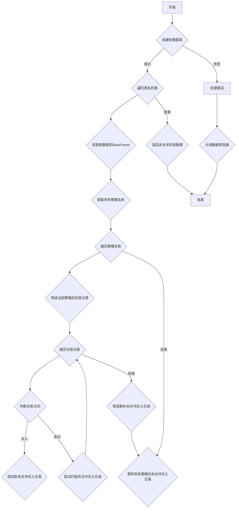

## 用途说明

calculate_unhedged_transactions 函数用于从 SQLite 数据库中读取交易记录，并计算每个策略的未对冲买入交易。它遍历数据库中的每个交易记录，并根据买卖方向和成交数量进行匹配，最终返回未完全对冲的买入交易记录。

## 参数

* db_path (str): SQLite 数据库文件的路径。
* table_names (list): 要读取的数据库表名列表，每个表都应包含交易记录。
## 用法

调用 calculate_unhedged_transactions(db_path, table_names) 并传递数据库文件路径和要读取的表名列表。该函数将返回一个 DataFrame，其中包含所有未对冲的买入交易记录。

## 示例

```python
import yuhanbolh as lh

# 计算数据库中所有表的未对冲交易
unhedged_transactions = lh.calculate_unhedged_transactions('path/to/trades.db', ['table1', 'table2'])

# 打印未对冲交易记录
print(unhedged_transactions)
```

## 流程图



## 注意事项

* 该函数假设你的交易记录表中包含以下列：'策略名称'，'买卖' (1 代表买入，-1 代表卖出)，'证券代码'，'成交数量'。
* 函数中使用先买先卖的逻辑进行对冲匹配。
* 确保已安装 pandas 和 sqlite3 库。
