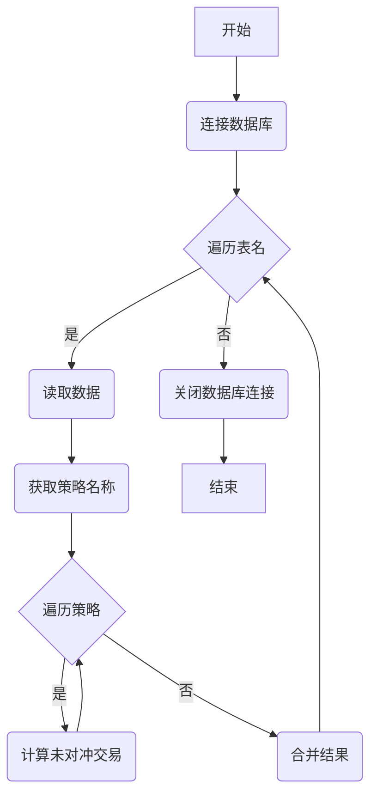

## 用途说明

该函数用于计算指定数据库表中所有策略的未对冲交易，采用后买先卖的原则，主要用于网格交易的止盈止损策略。

## 参数

* db_path (str): 数据库文件的路径。
* table_names (list): 包含要处理的数据库表名的列表。
## 返回值

* pandas.DataFrame: 包含所有未对冲买入交易的数据框，如果出现错误则返回 None。
## 用法

该函数通过遍历数据库表中的交易记录，根据"后买先卖"的原则，计算每个策略的未对冲买入交易。

函数调用示例：

```python
import yuhanbolh as lh

lh.unhedged_transactions = calculate_unhedged_transactions_sbb('交易数据.db', ['实测交易数据'])
print(unhedged_transactions)
```

## 示例

假设 实测交易数据 表中有如下数据：

调用 calculate_unhedged_transactions_sbb('交易数据.db', ['实测交易数据']) 后，将返回以下 DataFrame:

## 函数工作流程图



## 说明

* 该函数假设数据库表中包含以下列：'策略名称', '证券代码', '买卖', '成交数量'。
* '买卖' 列中，1 代表买入，-1 代表卖出。
* 函数采用后买先卖的原则进行对冲计算，即后买入的股票会优先被先卖出的股票对冲。
