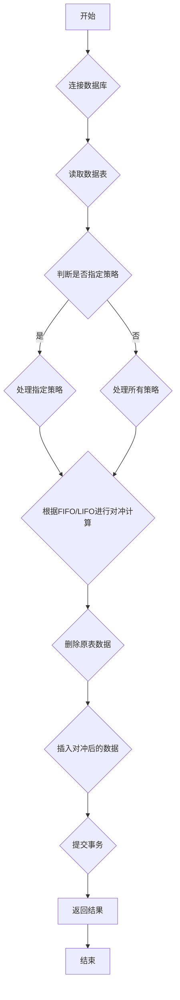

## 用途说明

对单一数据表中不同策略的交易数据进行对冲计算，支持先进先出(FIFO)和后进先出(LIFO)两种模式。

## 参数

* db_path (str): 数据库文件的路径。
* table_name (str): 要进行对冲计算的数据表名称。
* strategy_name (str, list, None): 策略名称，可以是字符串、字符串列表，或None/空字符串（处理所有策略）。
* is_fifo (bool): True为先买先卖(FIFO)，False为后买先卖(LIFO)，默认为True。
## 用法

函数调用示例及返回值说明。

## 示例

```python
# 先买先卖模式
unhedged_fifo_df = calculate_unhedged_transactions_unified(r"D:\wenjian\python\smart\data\guojin_account.db", 'execute_fund_grid_trade', 'grid_strategy', is_fifo=True)
print(unhedged_fifo_df)

# 后买先卖模式
unhedged_lifo_df = calculate_unhedged_transactions_unified(r"D:\wenjian\python\smart\data\guojin_account.db", 'execute_fund_grid_trade', 'grid_strategy', is_fifo=False)
print(unhedged_lifo_df)

# 处理所有策略
unhedged_all_df = calculate_unhedged_transactions_unified(r"D:\wenjian\python\smart\data\guojin_account.db", 'execute_fund_grid_trade')
print(unhedged_all_df)

# 处理指定策略列表
strategy_list = ['grid_strategy', 'tech_strategy']
unhedged_list_df = calculate_unhedged_transactions_unified(r"D:\wenjian\python\smart\data\guojin_account.db", 'execute_fund_grid_trade', strategy_list)
print(unhedged_list_df)
```

## 函数工作流程图



## 函数代码

```python
import sqlite3
import pandas as pd

def calculate_unhedged_transactions_unified(db_path, table_name, strategy_name=None, is_fifo=True):
    """
    计算指定策略的未对冲交易数据
    
    参数:
    db_path: 数据库路径
    table_name: 单一表名
    strategy_name: 策略名称，可以是字符串、字符串列表，或None/空字符串（处理所有策略）
    is_fifo: True为先买先卖(FIFO)，False为后买先卖(LIFO)
    
    返回:
    处理后的DataFrame，删除完全对冲的数据，保留对冲后的数据
    """
    
    def process_strategy_data(strategy_df, is_fifo):
        """内部函数：处理单个策略的对冲计算"""
        if strategy_df.empty:
            return pd.DataFrame()
        
        # 初始化未对冲买入交易列表
        unhedged_transactions = pd.DataFrame()
        
        # 按时间排序交易记录
        strategy_df = strategy_df.sort_values('成交时间')
        
        # 遍历交易记录进行对冲计算
        for _, row in strategy_df.iterrows():
            if row['买卖'] == 1:  # 买入
                unhedged_transactions = pd.concat([unhedged_transactions, pd.DataFrame([row])], ignore_index=True)
            elif row['买卖'] == -1:  # 卖出
                sell_shares = row['成交数量']
                
                # 根据is_fifo参数决定对冲顺序
                if is_fifo:
                    # 先买先卖：正序遍历
                    indices = unhedged_transactions.index
                else:
                    # 后买先卖：逆序遍历
                    indices = reversed(unhedged_transactions.index)
                
                for i in indices:
                    if i not in unhedged_transactions.index:
                        continue
                        
                    buy_txn = unhedged_transactions.loc[i]
                    if buy_txn['证券代码'] == row['证券代码'] and buy_txn['成交数量'] > 0:
                        if buy_txn['成交数量'] <= sell_shares:
                            # 完全对冲，删除该买入记录
                            sell_shares -= buy_txn['成交数量']
                            unhedged_transactions = unhedged_transactions.drop(i)
                        else:
                            # 部分对冲，更新买入数量
                            unhedged_transactions.at[i, '成交数量'] -= sell_shares
                            unhedged_transactions.at[i, '成交金额'] = unhedged_transactions.at[i, '成交数量'] * unhedged_transactions.at[i, '成交均价']
                            sell_shares = 0
                            break
                        
                        if sell_shares <= 0:
                            break
        
        # 重置索引
        unhedged_transactions = unhedged_transactions.reset_index(drop=True)
        return unhedged_transactions
    
    conn = None
    try:
        # 连接到数据库
        conn = sqlite3.connect(db_path)
        
        # 从数据库读取指定表的数据
        df = pd.read_sql(f"SELECT * FROM `{table_name}`", conn)
        
        if df.empty:
            return pd.DataFrame()
        
        # 确定要处理的策略列表
        if not strategy_name:
            # 如果策略名称为空，处理所有策略
            strategies_to_process = df['策略名称'].unique()
            print(f"找到 {len(strategies_to_process)} 个策略: {list(strategies_to_process)}")
        elif isinstance(strategy_name, list):
            # 如果是列表，处理列表中的策略
            strategies_to_process = strategy_name
            print(f"处理指定的 {len(strategies_to_process)} 个策略: {strategies_to_process}")
        else:
            # 如果是单个字符串，转换为列表
            strategies_to_process = [strategy_name]
            print(f"处理单个策略: {strategy_name}")
        
        # 检查数据的买卖方向分布
        buy_sell_counts = df['买卖'].value_counts()
        print(f"买卖方向分布: {dict(buy_sell_counts)}")
        
        all_unhedged_transactions = pd.DataFrame()
        
        # 对每个策略分别进行对冲计算
        for strategy in strategies_to_process:
                strategy_df = df[df['策略名称'] == strategy].copy()
                strategy_buy_sell = strategy_df['买卖'].value_counts()
                print(f"策略 '{strategy}': 总记录{len(strategy_df)}条, 买卖分布{dict(strategy_buy_sell)}")
                
                strategy_result = process_strategy_data(strategy_df, is_fifo)
                print(f"策略 '{strategy}' 对冲后剩余 {len(strategy_result)} 条记录")
                
                if not strategy_result.empty:
                    all_unhedged_transactions = pd.concat([all_unhedged_transactions, strategy_result], ignore_index=True)
            
        # 将处理后的数据写回数据库
        cursor = conn.cursor()
        
        if not strategy_name:
            # 如果处理所有策略，清空整个表
            cursor.execute(f"DELETE FROM `{table_name}`")
        else:
            # 如果处理指定策略，只删除这些策略的数据
            if isinstance(strategy_name, list):
                placeholders = ','.join(['?' for _ in strategy_name])
                cursor.execute(f"DELETE FROM `{table_name}` WHERE 策略名称 IN ({placeholders})", strategy_name)
            else:
                cursor.execute(f"DELETE FROM `{table_name}` WHERE 策略名称 = ?", (strategy_name,))
        
        if not all_unhedged_transactions.empty:
            all_unhedged_transactions.to_sql(table_name, conn, if_exists='append', index=False)
        
        conn.commit()
        return all_unhedged_transactions
        
    except Exception as e:
        print(f"An error occurred: {e}")
        return pd.DataFrame()
        
    finally:
        if conn is not None:
            conn.close()
```

