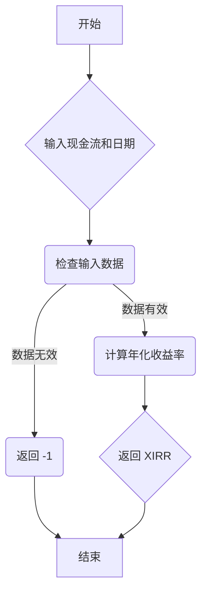

### 用途说明

calculate_xirr 函数用于计算一组现金流的年化收益率 (XIRR)。XIRR 是一种内部收益率 (IRR) 的计算方法，它考虑了现金流发生的时间差异。

### 参数

* cash_flows (list): 包含一系列现金流的列表，正数表示流入，负数表示流出。
* dates (list): 与 cash_flows 中的每个现金流对应的日期列表。日期格式可以是字符串或 datetime 对象。
### 返回值

* float: 计算得到的 XIRR 年化收益率，以小数形式表示。如果计算失败，则返回 -1。
### 用法

调用 calculate_xirr(cash_flows, dates) 函数，传入现金流列表和对应的日期列表，即可获得 XIRR 年化收益率。

### 示例

```python
import pandas as pd
import numpy as np
from scipy import optimize
import yuhanbolh as lh

cash_flows = [-1000, 500, 600, 700]
dates = ['2023-01-01', '2023-06-01', '2024-01-01', '2024-06-01']

xirr = lh.calculate_xirr(cash_flows, dates)
print(f"年化收益率 (XIRR): {xirr:.2%}")
```

### 函数工作流程图



### 代码

```python
# 计算xirr年化收益率
def calculate_xirr(cash_flows, dates):
    dates = [pd.to_datetime(date) for date in dates]
    if len(cash_flows) == 0 or len(cash_flows) != len(dates):
        return -1
    years = np.array([(d - dates[0]).days / 365.0 for d in dates])
    
    def f(r):
        with np.errstate(all='ignore'):
            try:
                return np.sum(cash_flows / (1 + r) ** years)
            except FloatingPointError:
                return np.inf

    try:
        result = optimize.newton(f, x0=0.1, tol=1e-6, maxiter=1000)
        return result if -1 < result < 1e10 else -1
    except (RuntimeError, OverflowError, FloatingPointError):
        return -1
```

