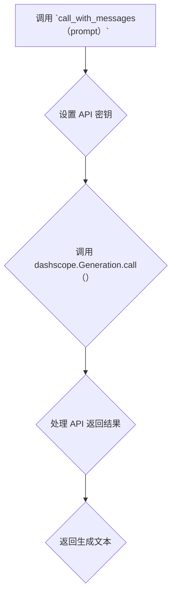

## 用途说明

该函数用于调用通义千问 API，根据提供的 prompt 生成文本。

## 参数

* prompt (str):  生成文本的提示信息。
## 用法

调用 call_with_messages(prompt)  函数，传入提示信息，即可获取生成的文本。

## 示例

```python
response = call_with_messages("你好，请帮我写一首关于春天的诗。")
print(response)
```

## 函数工作流程图



## 代码

```python
# 通义千问api调用   https://help.aliyun.com/document_detail/611472.html
def call_with_messages(prompt):
    dashscope.api_key = check_account("password", "DASHSCOPE_API_KEY") 
    try:
        response = dashscope.Generation.call(
            dashscope.Generation.Models.qwen_max,     # 模型选择
            prompt=prompt,
            max_tokens=2000,    # 最大字数限制
            top_p=0.8,      # 多样性设置
            repetition_penalty=1.1,     # 重复惩罚设置
            temperature=1.0,      # 随机性设置
            result_format='message',  # 结果格式
        )
        content = response["output"]["choices"][0]["message"]["content"]
        return content
    except Exception as e:
        print(f"生成故事时发生错误: {e}")
        return None
```

