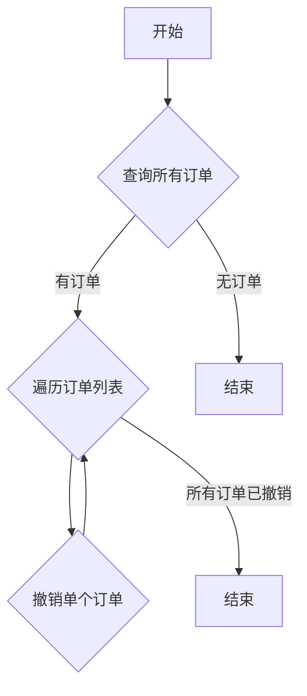

### 用途说明

该函数用于撤销指定股票账户下的所有订单。

### 参数

* xt_trader (object): xtrader交易对象，用于调用交易相关的API。
* acc (str): 股票账户号码。
### 用法

调用 cancel_all_orders(xt_trader, acc)  以撤销指定账户下的所有订单。

### 示例

```python
import yuhanbolh as lh
# 初始化 xtrader 交易对象
xt_trader = XTTrader()

# 设置股票账户
account = "your_account_number"

# 撤销所有订单
lh.cancel_all_orders(xt_trader, account)
```

### 流程图



### 代码

```python
def cancel_all_orders(xt_trader, acc):
    try:
        orders = xt_trader.query_stock_orders(acc, True)
        
        # 提取订单ID
        order_ids_strings = [order.order_id for order in orders]
        
        # 如果有订单，则尝试撤销
        if len(orders) != 0:
            print(f"查询到的订单ID： {order_ids_strings}")

            # 遍历订单ID并撤销
            for order in order_ids_strings:
                xt_trader.cancel_order_stock(acc, int(order))
                print(f"订单ID {order} 已成功撤销。")
            print("所有订单已成功撤销。")
        else:
            print("没有订单需要撤销。")
            
    except Exception as e:
        print("撤销订单时出现错误:", e)
```

