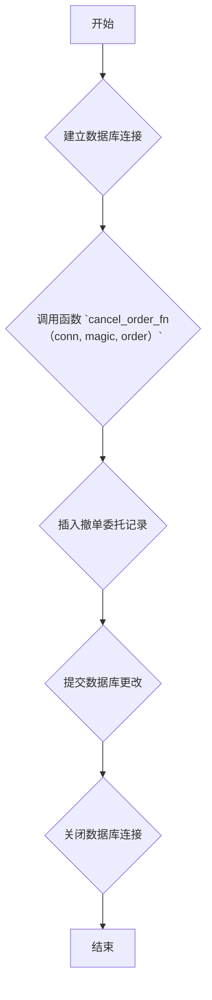

### 用途说明

该函数用于向数据库的 forex_order 表中插入一条撤单委托记录。撤单委托是指取消之前提交但尚未成交的订单的指令。

### 参数

* conn: 数据库连接对象。
* magic: EA 策略的唯一标识符 (int)。
* order: 被撤销的订单号 (int)。
### 用法

调用 cancel_order_fn(conn, magic, order) 将一条撤单委托记录插入到数据库。

### 示例

```python
import yuhanbolh as lh

# 建立数据库连接 (示例代码，实际情况可能需要修改)
import sqlite3
conn = sqlite3.connect('trading.db')

# 调用函数插入撤单委托记录
lh.cancel_order_fn(conn, 12345, 987654321)

# 关闭数据库连接
conn.close()
```

### 流程图



## 代码

```python
# 插入撤单委托
def cancel_order_fn(conn, magic, order):
    try:
        insert_query = """
        INSERT INTO forex_order (交易类型, EA_id, 订单号, 品种名称, 交易量, 价格, Limit挂单, 止损, 止盈, 价格偏差, 订单类型, 成交类型, 订单有效期, 订单到期, 订单注释, 持仓单号, 反向持仓单号)
        VALUES (?, ?, ?, ?, ?, ?, ?, ?, ?, ?, ?, ?, ?, ?, ?, ?, ?)
        """

        # 插入的值
        values = (8, magic, order, 0, 0, 0, 0, 0, 0, 0, 0, 0, 0, 0, 0, 0, 0)

        # 执行插入操作
        conn.execute(insert_query, values)
        conn.commit()

    except Exception as e:
        print("An error occurred:", e)
```

