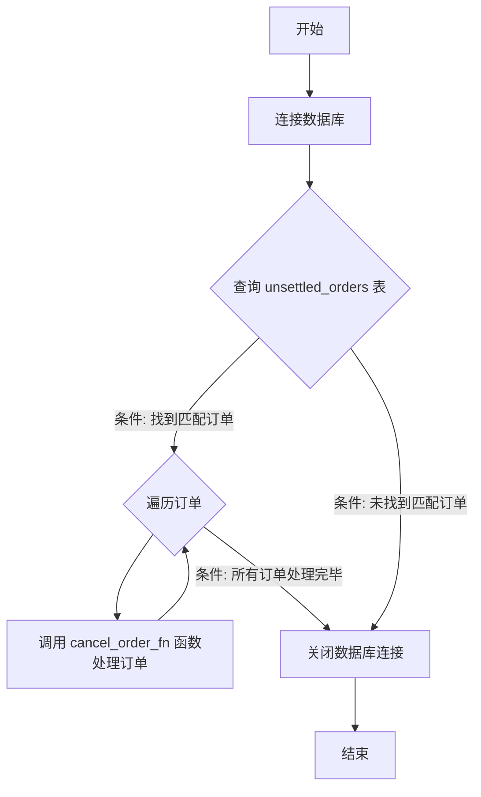

### 用途说明

该函数用于撤销数据库中指定 magic 值的未成交订单，并将撤销的订单信息插入到已成交订单表中。

### 参数

* db_path (str): 数据库文件路径。
* magic (int): 用于筛选订单的 magic 值。
### 工作流程



### 代码

```python
import sqlite3

# 示例 cancel_order_fn 函数，实际功能需根据需求定义
def cancel_order_fn(conn, magic, ticket):
    """
    将指定订单从 unsettled_orders 表中删除，并插入到 forex_order 表中
    """
    try:
        # 从 unsettled_orders 表中删除订单
        conn.execute("DELETE FROM unsettled_orders WHERE magic = ? AND ticket = ?", (magic, ticket))
        # 将订单信息插入到 forex_order 表中，具体字段和值需根据实际情况修改
        conn.execute("INSERT INTO forex_order (magic, ticket, status) VALUES (?, ?, ?)", (magic, ticket, 'canceled'))
        conn.commit()
        print(f"订单 {ticket} 已成功撤销并插入到 forex_order 表中")
    except sqlite3.OperationalError as e:
        print(f"处理订单 {ticket} 时出错: {e}")
        
# 插入撤销未成交的订单
def cancel_pending_order(db_path, magic):
    """
    从 unsettled_orders 表中读取特定 magic 的数据，并将其插入到 forex_order 表中
    :param db_path: 数据库文件路径
    :param magic: 用于筛选的 magic 值
    """
    # 连接到数据库
    conn = sqlite3.connect(db_path)

    try:
        # 查询指定 magic 值的 unsettled_orders 表中的数据
        select_query = "SELECT ticket FROM unsettled_orders WHERE magic = ?"
        cursor = conn.execute(select_query, (magic,))
        rows = cursor.fetchall()

        # 遍历查询结果并插入到 forex_order 表中
        for row in rows:
            ticket = row[0]
            cancel_order_fn(conn, magic, ticket)

    except sqlite3.OperationalError as e:
        print(f"查询或插入时出错: {e}")

    finally:
        # 关闭数据库连接
        conn.close()
```

