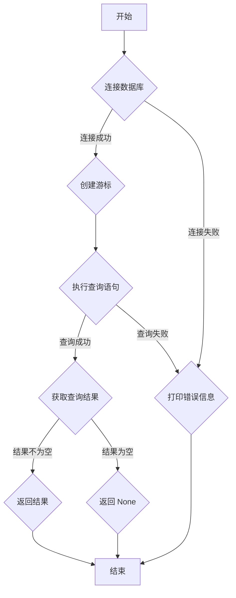

## 用途说明

check_account 函数用于检索指定项目在数据库中的账号或密码。它连接到指定的 SQLite 数据库，并根据提供的项目名称和列名查询相应的账号或密码信息。

## 参数

* column_name (str): 指定要检索的列名，例如 "username" 或 "password"。
* project_name (str): 指定要检索的项目名称。
## 用法

调用 check_account(column_name, project_name) 函数，传入要查询的列名和项目名称，即可获取相应的账号或密码。如果查询成功，函数会返回字符串类型的结果；如果查询失败或未找到匹配项，则返回 None。

## 示例

```python
account_password = check_account('username', 'example_project')
print(f"账号密码为：{account_password}")
```

## 流程图



## 代码

```python
import sqlite3

def check_account(column_name, project_name):
    """
    检索数据库中特定项目的账号密码。

    Args:
        column_name (str): 指定要检索的账号或密码列。
        project_name (str): 指定要检索的项目名称。

    Returns:
        str: 账号或密码 (如果找到)，否则返回 None。
    """
    db_path = r"D:\wenjian\python\data\data\mm.db"
    try:
        conn = sqlite3.connect(db_path)
        cursor = conn.cursor()

        # 使用 column_name 参数构建查询语句
        query = f"""
        SELECT {column_name}
        FROM connect_account_password
        WHERE project_name = ?
        """

        cursor.execute(query, (project_name,))
        result = cursor.fetchone()

        cursor.close()
        conn.close()

        if result:
            return result[0]  # 返回查询结果而不是列表
        else:
            return None

    except Exception as e:
        print(f"数据库操作错误：{e}")
        return None
```

