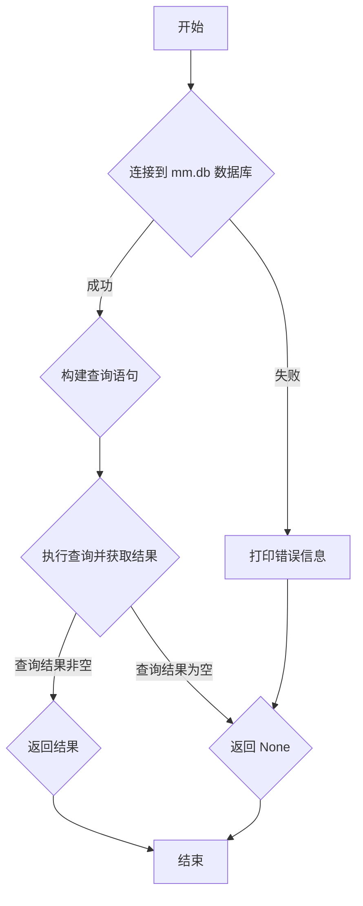

## 用途说明

check_account 函数用于从 mm.db 数据库中检索指定项目的账号或密码。

## 参数

* column_name (str): 要检索的列名，例如 "username" 或 "password"。
* project_name (str): 要检索账号或密码所属的项目名称。
## 用法

调用 check_account(column_name, project_name)，传入列名和项目名称，函数将返回查询结果。

* 如果查询成功，返回字符串类型的账号或密码。
* 如果查询无结果，返回 None。
* 如果出现数据库错误，打印错误信息并返回 None。
## 示例

```python
import yuhanbolh as lh

account = lh.check_account('username', 'example_project')
print(f"账号为：{account}")

password = lh.check_account('password', 'example_project')
print(f"密码为：{password}")
```

## 流程图



