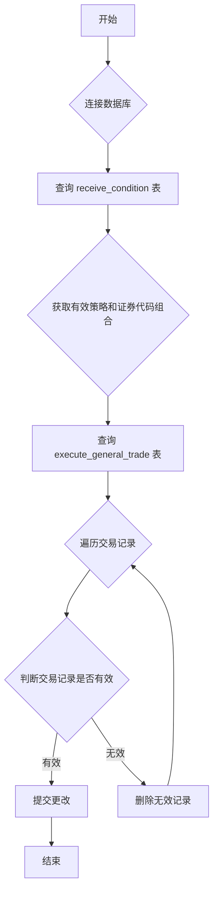

### 用途说明

该函数用于清理 execute_general_trade 表中的无效交易记录，确保该表只包含根据 receive_condition 表中策略和证券代码组合生成的有效交易记录。

### 参数

* conn: 数据库连接对象。
### 工作流程



### 代码

```python
# 清洗execute_general_trade表
def clean_execute_general_trade(conn):
    """
    清洗execute_general_trade表
    """
    cursor = conn.cursor()
    # 从receive_condition获取(策略名称, 证券代码)的集合
    cursor.execute("SELECT 策略名称, 证券代码 FROM receive_condition")
    receive_keys = set(cursor.fetchall())

    # 获取execute_general_trade中非'问财轮动-注询问'的所有行
    cursor.execute("SELECT rowid, 策略名称, 证券代码 FROM execute_general_trade WHERE 策略名称 != '问财轮动-注询问'")
    rows = cursor.fetchall()
    for rowid, strategy, code in rows:
        if (strategy, code) not in receive_keys:
            cursor.execute("DELETE FROM execute_general_trade WHERE rowid=?", (rowid,))
    conn.commit()
```

