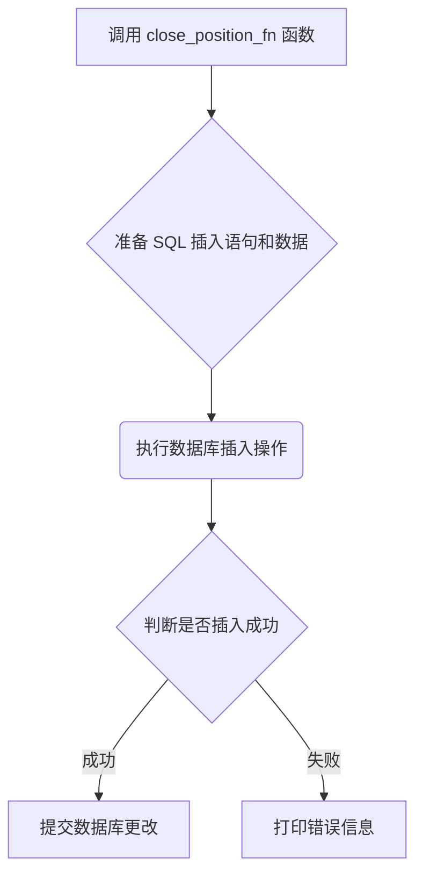

### 用途说明

本函数用于向数据库表 forex_order 插入一条平仓委托记录。

### 参数

* conn (object): 数据库连接对象。
* magic (int): EA 标识符。
* symbol (str): 交易品种名称。
* volume (float): 交易量。
* deviation (int): 价格偏差。
* type (int): 订单类型。
* comment (str): 订单注释。
* position (int): 持仓单号。
### 用法

调用 close_position_fn(conn, magic, symbol, volume, deviation, type, comment, position)  将平仓委托信息插入数据库。

### 示例

```python
import yuhanbolh as lh

# 建立数据库连接 (假设已存在名为 conn 的连接对象)
# ...

# 调用函数插入平仓委托记录
lh.close_position_fn(conn, 12345, "EURUSD", 0.1, 5, 0, "Close at market", 1234)
```

### 流程图



## 代码

```python
# 插入平仓委托
def close_position_fn(conn, magic, symbol, volume, deviation, type, comment, position):
    try:
        insert_query = """
        INSERT INTO forex_order (交易类型, EA_id, 订单号, 品种名称, 交易量, 价格, Limit挂单, 止损, 止盈, 价格偏差, 订单类型, 成交类型, 订单有效期, 订单到期, 订单注释, 持仓单号, 反向持仓单号)
        VALUES (?, ?, ?, ?, ?, ?, ?, ?, ?, ?, ?, ?, ?, ?, ?, ?, ?)
        """

        # 插入的值
        values = (1, magic, 0, symbol, volume, 0, 0, 0, 0, deviation, type, 1, 0, 0, comment, position, 0)

        # 执行插入操作
        conn.execute(insert_query, values)
        conn.commit()

    except Exception as e:
        print("An error occurred:", e)
```

