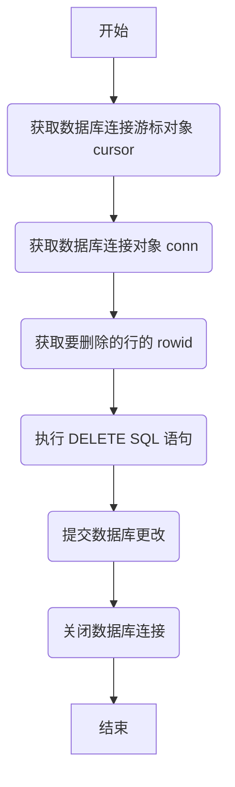

### 用途说明

该函数用于从数据库表 receive_condition 中删除指定 rowid 的行。

### 参数

* cursor (cursor object): 数据库连接游标对象，用于执行 SQL 语句。
* conn (connection object): 数据库连接对象，用于提交数据库操作。
* rowid (int): 要删除的行的 rowid 值。
### 用法

调用 delete_receive_condition_row(cursor, conn, rowid)，传入数据库连接游标对象、数据库连接对象和要删除的行的 rowid，即可删除该行。

### 示例

```python
import yuhanbolh as lh

# 建立数据库连接
conn = sqlite3.connect('mydatabase.db')
cursor = conn.cursor()

# 要删除的行的 rowid
rowid_to_delete = 1

# 调用函数删除行
delete_receive_condition_row(cursor, conn, rowid_to_delete)

# 关闭数据库连接
conn.close()
```

### 函数工作流程图



```python
def delete_receive_condition_row(cursor, conn, rowid):
    """
    删除receive_condition表中的行
    """
    cursor.execute("DELETE FROM receive_condition WHERE rowid=?", (rowid,))
    conn.commit()
```

