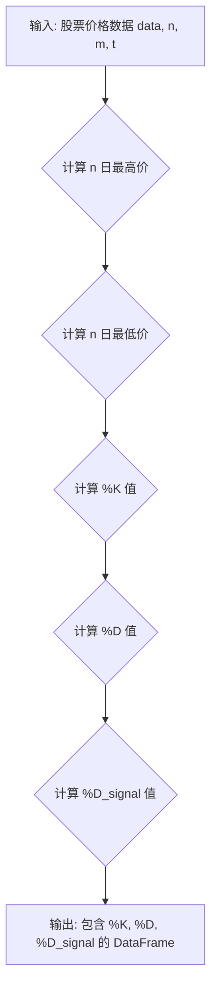

## 用途说明

该函数用于计算金融市场技术分析中常用的随机指标(Stochastic Oscillator)。随机指标是一个动量指标，用于比较股票的收盘价与其在一段时间内的价格范围。

## 参数

* data (pd.DataFrame): 包含股票价格信息的 Pandas DataFrame，必须包含 'high'、'low' 和 'close' 列。
* n (int): 计算 %K 值的时间周期，通常为 14。
* m (int): 计算 %D 值的平滑周期，通常为 3。
* t (int): 计算 %D_signal 值的平滑周期，通常为 3。
## 返回值

返回一个 Pandas DataFrame，包含以下列：

* 'Stochastic_%K':  %K 值。
* 'Stochastic_%D':  %D 值，是 %K 值的 m 日移动平均线。
* 'Stochastic_%D_signal':  %D_signal 值，是 %D 值的 t 日移动平均线。
## 用法

通过将股票价格数据和所需参数传递给函数来调用该函数。函数将返回一个包含计算结果的 DataFrame。

## 示例

```python
import pandas as pd

# 示例股票价格数据
data = pd.DataFrame({
    'high': [10, 12, 15, 14, 16, 18, 20, 19, 17, 15],
    'low': [8, 9, 10, 11, 12, 13, 14, 15, 13, 11],
    'close': [9, 11, 14, 13, 15, 17, 19, 18, 16, 14]
})

# 计算随机指标
result = STOK(data, 14, 3, 3)

# 打印结果
print(result)
```

## 函数工作流程图



## 代码

```python
# 计算Stochastic，k是主线，d_signal是信号线，参数有4，一个是数据源，另外三个为日期，一般为STOK(data, 14, 3, 3)
def STOK(data, n, m, t):
    # 计算过去n天的最高价
    high = data['high'].rolling(n).max()
    # 计算过去n天的最低价
    low = data['low'].rolling(n).min()
    # 计算%K值
    k = 100 * (data['close'] - low) / (high - low)
    # 使用m天的滚动平均计算%D值
    d = k.rolling(m).mean()
    # 使用t天的滚动平均计算%D_signal值
    d_signal = d.rolling(t).mean()
    
    # 创建一个新的DataFrame来存储结果
    result = pd.DataFrame({
        'Stochastic_%K': k,
        'Stochastic_%D': d,
        'Stochastic_%D_signal': d_signal
    }, index=data.index)  # 使用原始数据的索引
    
    return result.dropna()
```

